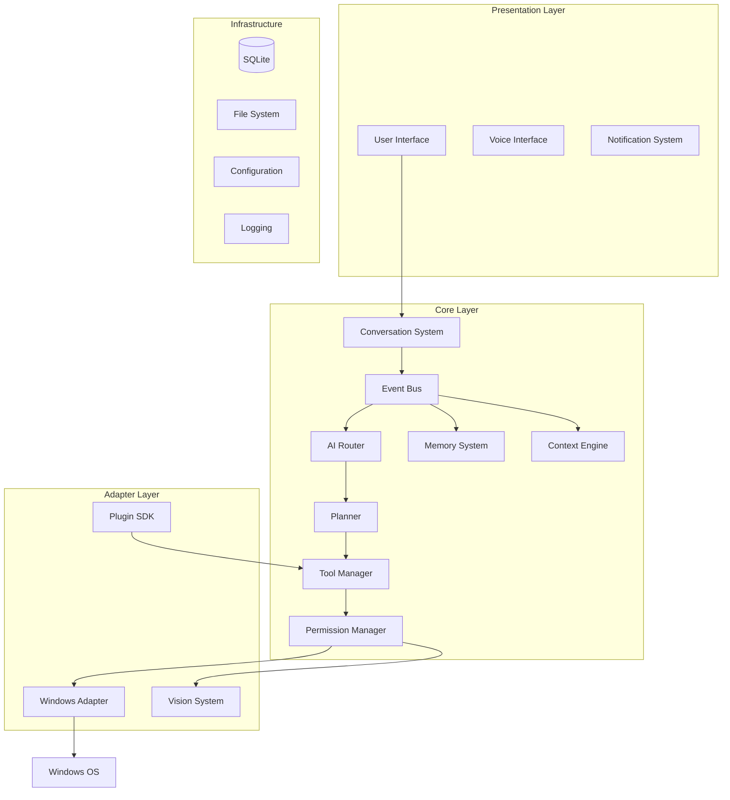
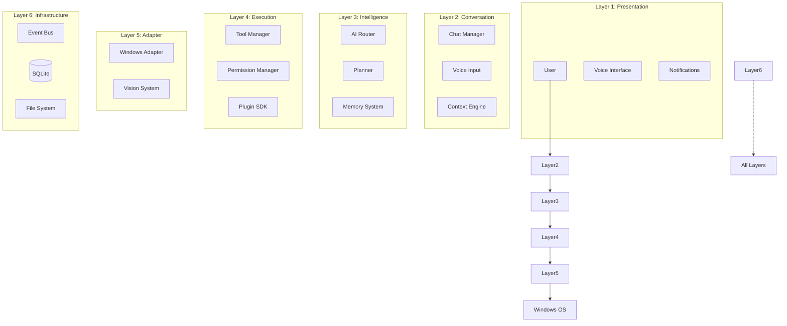
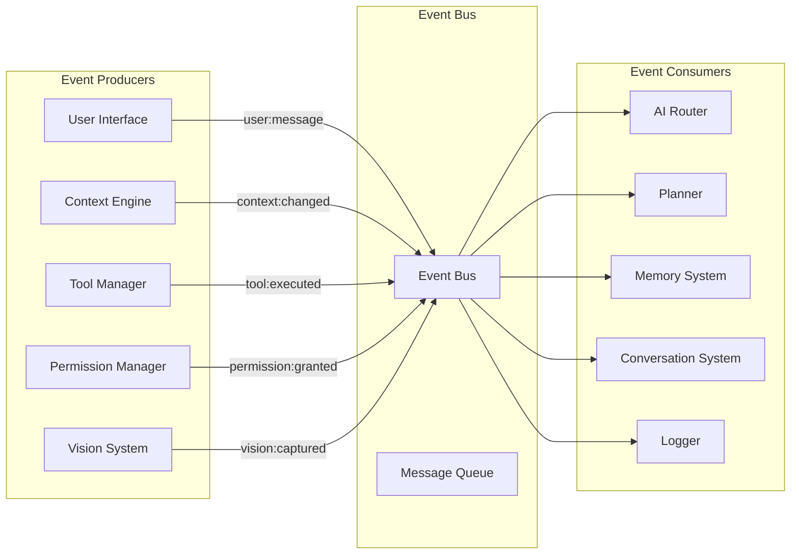
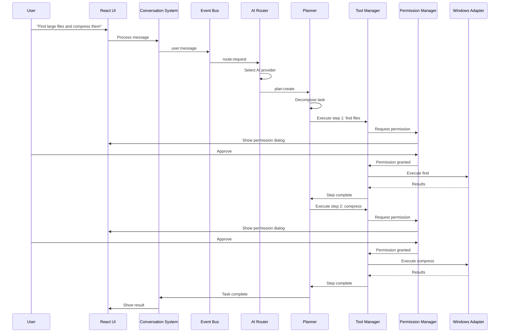
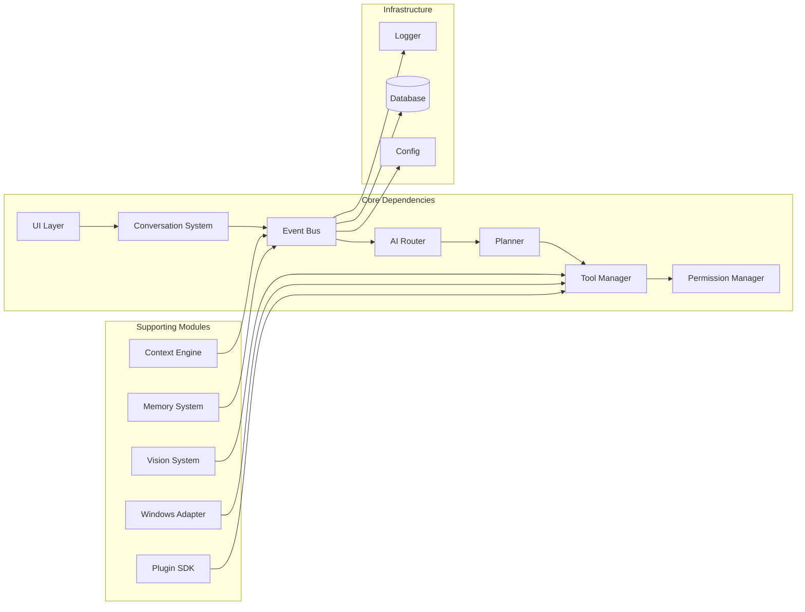
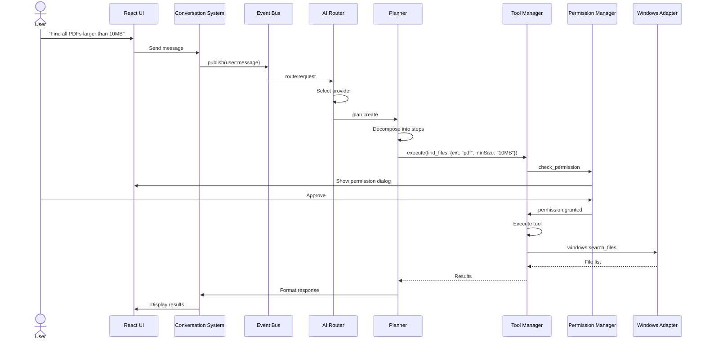

# System Architecture

**Document ID:** 02-System-Architecture  
**Status:** Approved  
**Version:** 1.0.0  
**Last Updated:** 2026-07-18

---

## 1. Purpose

This document defines the high-level system architecture of AIOS, including component relationships, communication flows, and design patterns.

## 2. High-Level Architecture

AIOS follows a **layered, event-driven architecture** with clear separation of concerns.

## 4. Layered Architecture

## 5. Event-Driven Architecture

## 6. Communication Flow

## 7. Module Dependencies

## 7. Module Responsibilities

| Module | Responsibility |
|--------|---------------|
| **UI Layer** | React-based desktop interface, command palette, chat, notifications |
| **Conversation System** | Manages chat lifecycle, voice input, message routing |
| **Event Bus** | Decoupled communication between all modules |
| **AI Router** | Routes requests to AI providers, handles failover |
| **Planner** | Decomposes tasks, manages execution graph, handles recovery |
| **Tool Manager** | Registers, validates, and executes tools |
| **Permission Manager** | Gates all tool execution through permission levels |
| **Memory System** | Short-term, long-term, and semantic memory |
| **Context Engine** | Tracks active applications, files, and user activity |
| **Windows Adapter** | Abstracts Windows API calls behind a safe interface |
| **Vision System** | OCR, screenshot capture, UI understanding |
| **Plugin SDK** | Third-party tool and event registration |
| **Event Bus** | Decoupled inter-module communication |

## 8. Data Flow: User Request

## 9. Design Patterns

| Pattern | Usage |
|---------|-------|
| **Event-Driven** | Inter-module communication via Event Bus |
| **Observer** | Modules subscribe to events they care about |
| **Strategy** | AI providers are swappable strategies |
| **Command** | Tool execution follows command pattern |
| **Chain of Responsibility** | Permission checks chain through levels |
| **Adapter** | Windows Adapter abstracts OS APIs |
| **Factory** | Tool and provider creation |
| **Singleton** | Event Bus, Database, Configuration |

## 10. Future Extensibility

- **New AI providers** — Add via AI Router strategy pattern
- **New tools** — Register via Tool Manager
- **New plugins** — SDK with manifest registration
- **New OS support** — Create new Adapter implementations
- **New input modes** — Voice, gesture, gaze — all feed into Conversation System

## 11. Risks

| Risk | Impact | Mitigation |
|------|--------|------------|
| Single point of failure (Event Bus) | High | Persistent queue, health checks |
| AI provider latency | Medium | Parallel routing, timeout, fallback |
| Plugin memory leaks | Medium | Sandboxed execution, resource limits |
| Windows API changes | Medium | Abstracted adapter layer |
| Permission fatigue | Medium | Smart defaults, session permissions |
