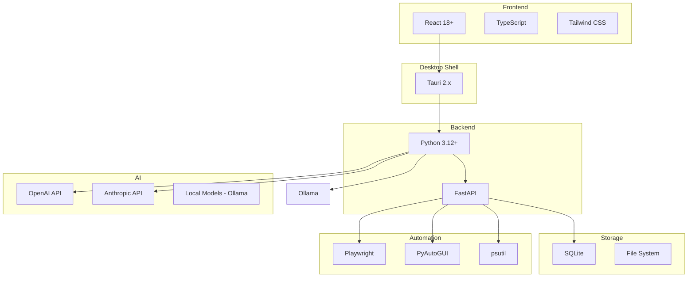

# Technology Decision Record

**Document ID:** 03-TDR  
**Status:** Approved  
**Version:** 1.0.0  
**Last Updated:** 2026-07-18

---

## 1. Purpose

This document records the technology decisions made for AIOS, including the rationale for each choice and alternatives that were considered and rejected.

## 2. Technology Stack Overview

## 12. Technology Decisions

| Technology | Decision | Rationale |
|------------|----------|-----------|
| **React 18+** | Chosen | Mature ecosystem, component model, large talent pool |
| **TypeScript** | Chosen | Type safety, better DX, catches errors at compile time |
| **Tauri 2.x** | Chosen | Lightweight, secure, Rust-based, smaller bundle than Electron |
| **Python 3.12+** | Chosen | Best AI/ML ecosystem, rich library support |
| **FastAPI** | Chosen | Async, type-safe, auto-docs, high performance |
| **SQLite** | Chosen | Local-first, zero-config, sufficient for desktop app |
| **Playwright** | Chosen | Modern web automation, reliable selectors |
| **PyAutoGUI** | Chosen | Cross-platform GUI automation |
| **psutil** | Chosen | System monitoring, process management |

## 12. Implementation Notes

- All inter-module communication goes through the Event Bus
- Modules should never import each other directly
- Each module has a single responsibility
- Configuration is centralized and environment-aware
- Logging is structured (JSON) and level-based
- All errors are typed and propagated through events
