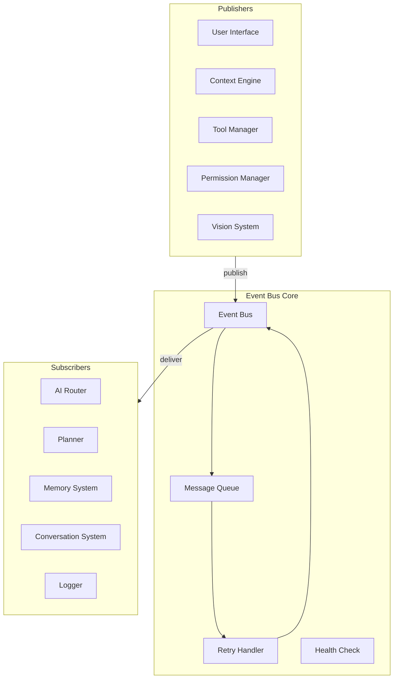
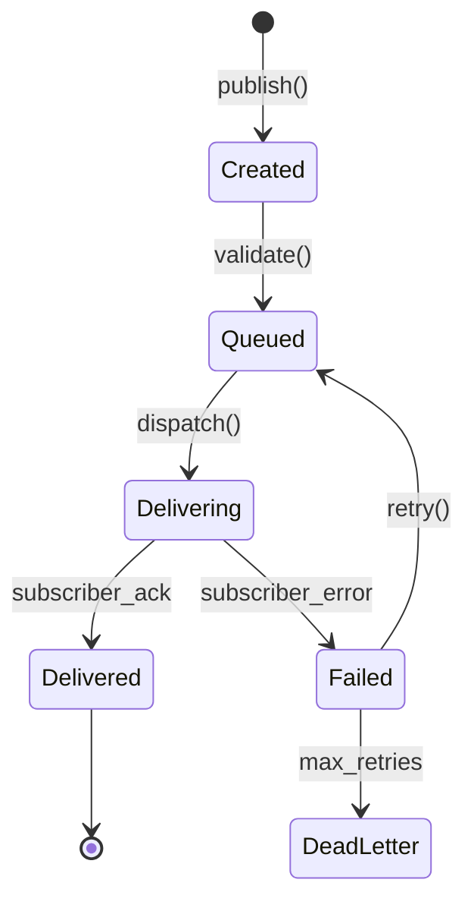
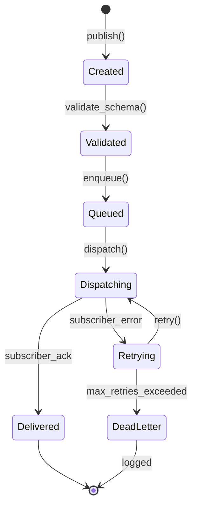

# Event Bus

**Document ID:** 07-Event-Bus  
**Status:** Approved  
**Version:** 1.0.0  
**Last Updated:** 2026-07-18

---

## 1. Purpose

The Event Bus is the central communication backbone of AIOS. It enables decoupled, asynchronous communication between all modules.

## 2. Architecture



## 3. Event Naming Convention

Events follow a `domain:action:state` pattern:

| Event | Description |
|-------|-------------|
| `user:message` | User sent a message |
| `user:command` | User issued a command |
| `ai:response` | AI provider returned response |
| `ai:error` | AI provider error |
| `tool:execute` | Tool execution requested |
| `tool:executed` | Tool execution completed |
| `tool:failed` | Tool execution failed |
| `permission:requested` | Permission request created |
| `permission:granted` | Permission approved |
| `permission:denied` | Permission rejected |
| `context:changed` | Context state changed |
| `memory:stored` | Memory persisted |
| `memory:retrieved` | Memory retrieved |
| `plugin:loaded` | Plugin loaded |
| `plugin:error` | Plugin error |
| `system:startup` | System initialized |
| `system:shutdown` | System shutting down |
| `error:occurred` | Unhandled error |

## 3. Event Lifecycle



## 4. Event Payload Structure

```python
@dataclass
class Event:
    id: str                    # UUID
    type: str                  # "domain:action:state"
    source: str                # Module name
    timestamp: datetime        # ISO 8601
    payload: dict              # Event-specific data
    correlation_id: str        # Trace across events
    retry_count: int = 0
    priority: int = 0         # 0=normal, 1=high, 2=critical
```

## 5. Event Catalog

| Event | Publisher | Subscribers | Payload |
|-------|-----------|-------------|---------|
| `user:message` | Conversation System | AI Router, Memory | `{text, conversation_id, timestamp}` |
| `user:command` | Conversation System | AI Router | `{command, args, timestamp}` |
| `ai:response` | AI Router | Conversation System, Memory | `{text, provider, tokens_used}` |
| `ai:error` | AI Router | Conversation System | `{provider, error, retry_count}` |
| `tool:execute` | Planner | Tool Manager | `{tool_id, params, correlation_id}` |
| `tool:executed` | Tool Manager | Planner, Memory | `{tool_id, result, duration}` |
| `tool:failed` | Tool Manager | Planner | `{tool_id, error, correlation_id}` |
| `permission:requested` | Tool Manager | Permission Manager | `{tool_id, action, level}` |
| `permission:granted` | Permission Manager | Tool Manager | `{request_id, level}` |
| `permission:denied` | Permission Manager | Tool Manager | `{request_id, reason}` |
| `context:changed` | Context Engine | Memory, AI Router | `{app, file, activity}` |
| `memory:stored` | Memory System | — | `{memory_id, type, timestamp}` |
| `memory:retrieved` | Memory System | AI Router | `{query, results, count}` |
| `plugin:loaded` | Plugin Manager | Tool Manager | `{plugin_id, tools, events}` |
| `plugin:error` | Plugin Manager | Logger | `{plugin_id, error}` |
| `system:startup` | Main | All | `{version, config}` |
| `system:shutdown` | Main | All | `{reason, timestamp}` |
| `error:occurred` | Any | Logger, UI | `{module, error, traceback}` |

## 3. Event Lifecycle



## 4. Retry Strategy

| Parameter | Value |
|-----------|-------|
| Max retries | 3 |
| Backoff | Exponential (1s, 2s, 4s) |
| Retry condition | Transient errors only |
| Dead letter | Logged to error store |

## 5. Public Interface

```python
class EventBus:
    async def publish(self, event_type: str, payload: dict, priority: int = 0) -> str
    async def subscribe(self, event_type: str, handler: Callable) -> UUID
    async def unsubscribe(self, subscription_id: UUID) -> bool
    async def get_history(self, event_type: str, limit: int = 100) -> list[Event]
```

## 6. Implementation Notes

- Events are delivered at least once
- Subscribers are called asynchronously
- Slow subscribers don't block fast ones
- Event history is persisted to SQLite
- Dead letters are logged and alert the user
