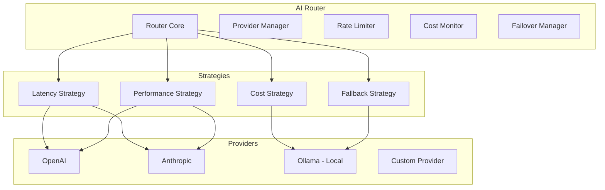
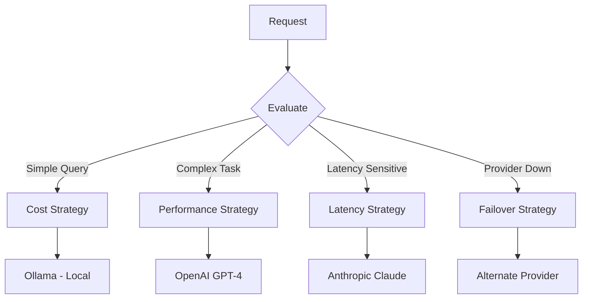
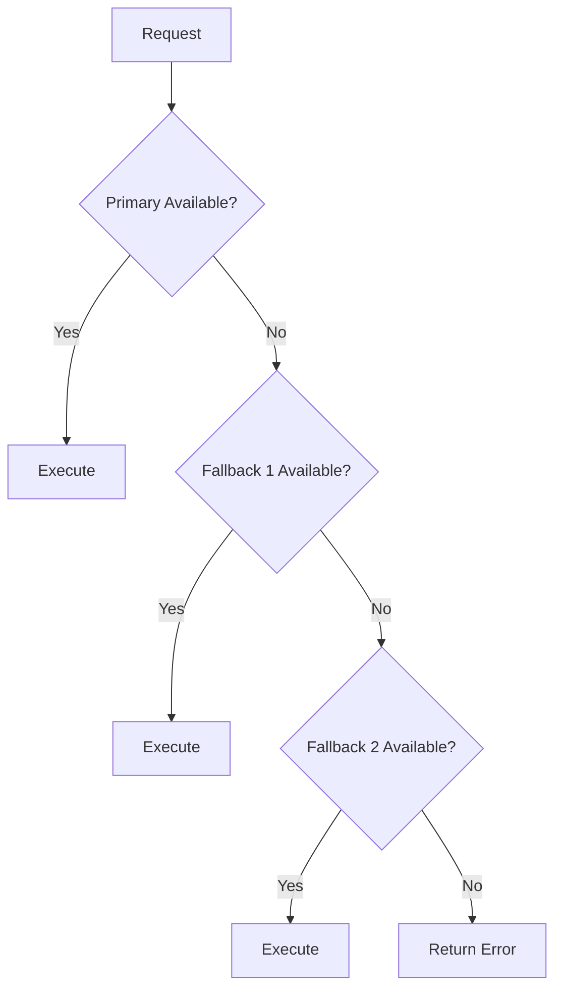
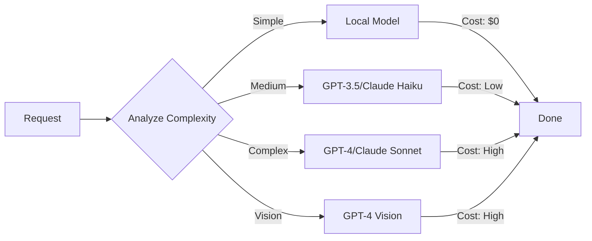

# AI Router

**Document ID:** 08-AI-Router  
**Status:** Approved  
**Version:** 1.0.0  
**Last Updated:** 2026-07-18

---

## 1. Purpose

The AI Router is responsible for abstracting AI provider interactions, routing requests to the appropriate provider, handling failover, and optimizing cost and performance.

## 2. Architecture



## 3. Provider Abstraction

```python
class AIProvider(ABC):
    @abstractmethod
    async def chat(self, messages: list[dict], tools: list[dict] = None) -> AIResponse
    @abstractmethod
    async def chat_stream(self, messages: list[dict], tools: list[dict] = None) -> AsyncIterator[str]
    @abstractmethod
    async def embed(self, text: str) -> list[float]
    @abstractmethod
    async def health_check(self) -> bool
    @property
    @abstractmethod
    def model(self) -> str
    @property
    @abstractmethod
    def capabilities(self) -> set[str]
```

## 4. Routing Strategy



## 5. Failover Strategy



## 6. Rate Limiting

| Provider | Requests/min | Tokens/min | Concurrent |
|----------|-------------|------------|------------|
| OpenAI GPT-4 | 20 | 40,000 | 3 |
| OpenAI GPT-3.5 | 60 | 90,000 | 6 |
| Anthropic Claude | 30 | 50,000 | 4 |
| Ollama (local) | Unlimited | Unlimited | 10 |

## 7. Cost Optimization



## 8. Model Capabilities

| Capability | GPT-4 | GPT-3.5 | Claude 3 | Local |
|------------|-------|---------|----------|-------|
| Chat | ✓ | ✓ | ✓ | ✓ |
| Tools | ✓ | ✓ | ✓ | Limited |
| Vision | ✓ | ✗ | ✓ | ✗ |
| Long context | 128K | 16K | 200K | 8K |
| Code | ✓ | ✓ | ✓ | Limited |
| Reasoning | ✓ | Basic | ✓ | Basic |

## 9. Public Interface

```python
class AIRouter:
    async def route(self, request: AIRequest) -> AIResponse
    async def route_stream(self, request: AIRequest) -> AsyncIterator[str]
    async def register_provider(self, provider: AIProvider) -> None
    async def health_check(self) -> dict[str, bool]
    def get_capabilities(self) -> dict[str, list[str]]
```

## 10. Implementation Notes

- Providers are loaded from configuration
- Health checks run every 30 seconds
- Rate limiting is per-provider and per-user
- Cost tracking is persisted to SQLite
- Failover is automatic and transparent
