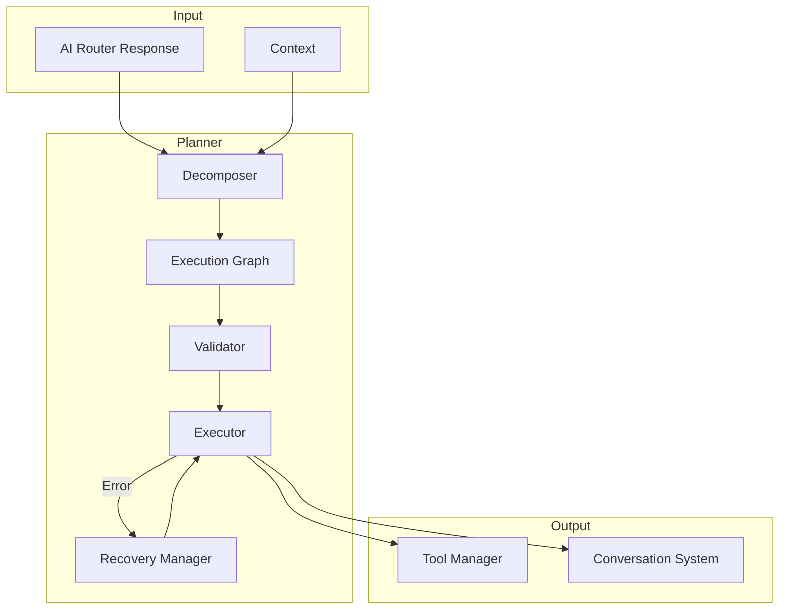
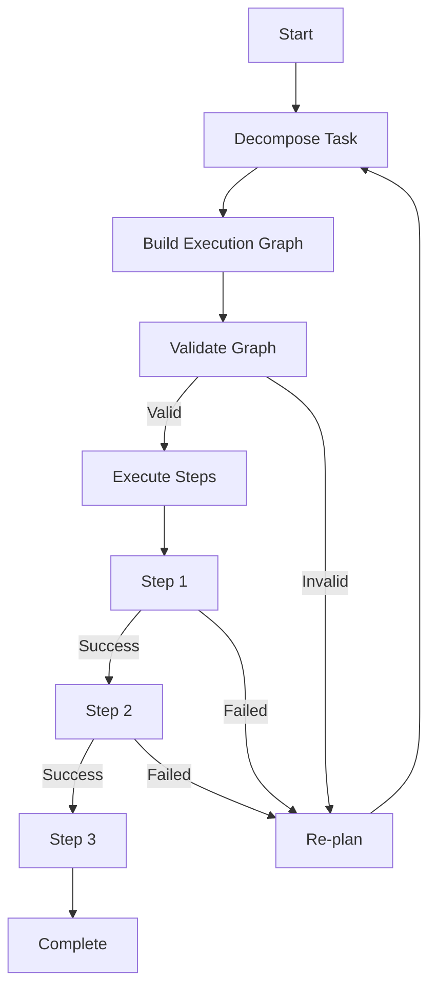

# Planner

**Document ID:** 09-Planner  
**Status:** Approved  
**Version:** 1.0.0  
**Last Updated:** 2026-07-18

---

## 1. Purpose

The Planner decomposes complex user requests into executable steps, manages the execution graph, handles validation, and implements recovery strategies.

## 2. Architecture



## 3. Task Decomposition

```mermaid
graph TD
    U[User: "Find large files and compress them"] --> D[Decomposer]
    D --> S1[Step 1: Find files > 100MB]
    D --> S2[Step 2: Show files to user]
    D --> S3[Step 3: Compress selected files]
    D --> S4[Step 4: Move to archive folder]

    S1 --> V1{Validate}
    V1 -->|OK| E1[Execute find]
    E1 --> S2
    S2 --> V2{User confirms}
    V2 -->|Yes| S3
    V2 -->|No| Cancel[Cancel]
    S3 --> V3{Validate}
    V3 -->|OK| E3[Execute compress]
    E3 --> S4
    S4 --> Done[Complete]
```

## 3. Execution Graph



## 4. Validation

```python
@dataclass
class PlanValidation:
    is_valid: bool
    errors: list[str]
    warnings: list[str]
    estimated_risk: float  # 0.0 to 1.0
    required_permissions: list[PermissionLevel]
```

## 5. Recovery Strategies

| Failure Type | Strategy |
|-------------|----------|
| Tool not found | Re-plan without tool |
| Permission denied | Ask user for alternative |
| Tool execution error | Retry with backoff |
| Invalid plan | Re-decompose with constraints |
| Timeout | Break into smaller steps |

## 6. Public Interface

```python
class Planner:
    async def create_plan(self, request: str, context: Context) -> Plan
    async def execute_plan(self, plan: Plan) -> PlanResult
    async def validate_plan(self, plan: Plan) -> PlanValidation
    async def recover_plan(self, plan: Plan, failed_step: Step) -> Plan
```

## 7. Implementation Notes

- Plans are persisted to SQLite for recovery
- Execution graph supports parallel steps
- Each step has a timeout (default 30s)
- Recovery strategies are configurable per tool
- Plans can be paused, resumed, and cancelled
