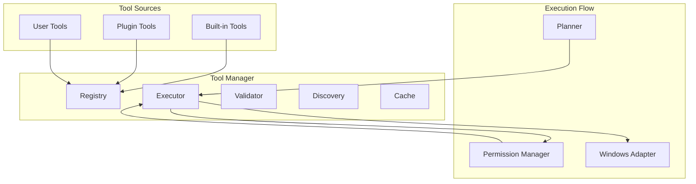
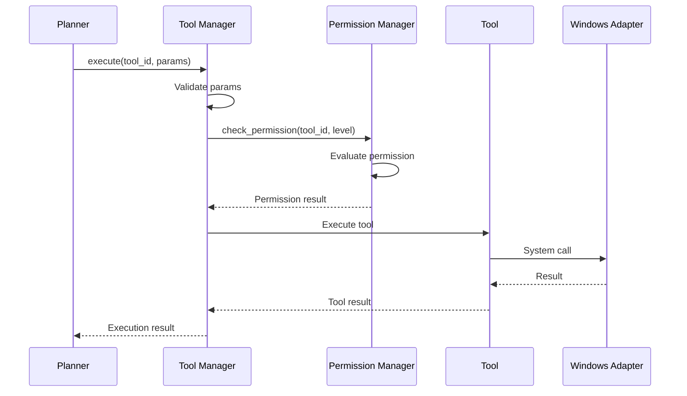

# Tool Manager

**Document ID:** 10-Tool-Manager  
**Status:** Approved  
**Version:** 1.0.0  
**Last Updated:** 2026-07-18

---

## 1. Purpose

The Tool Manager is responsible for registering, validating, discovering, and executing tools. It is the gateway through which all system actions pass.

## 2. Architecture



## 2. Tool Contract

```python
@dataclass
class ToolContract:
    id: str
    name: str
    description: str
    parameters: dict  # JSON Schema
    returns: dict     # JSON Schema
    permission_level: PermissionLevel
    timeout: int = 30
    requires_confirmation: bool = True
    category: str = "general"
    tags: list[str] = field(default_factory=list)
```

## 3. Tool Registration

```python
class ToolManager:
    async def register_tool(self, tool: ToolContract, handler: Callable) -> None
    async def unregister_tool(self, tool_id: str) -> None
    async def get_tool(self, tool_id: str) -> ToolContract
    async def list_tools(self, category: str = None) -> list[ToolContract]
    async def search_tools(self, query: str) -> list[ToolContract]
```

## 4. Tool Execution Flow



## 5. Tool Categories

| Category | Examples | Permission Level |
|----------|----------|-----------------|
| **Read** | File search, system info, clipboard read | Read |
| **Safe** | Create files, open apps, web search | Safe |
| **Workspace** | Edit files, organize folders, rename | Workspace |
| **Sensitive** | Delete files, install software, modify registry | Sensitive |

## 6. Result Handling

```python
@dataclass
class ToolResult:
    success: bool
    data: Any
    error: str | None = None
    duration: float = 0.0
    warnings: list[str] = field(default_factory=list)
```

## 7. Public Interface

```python
class ToolManager:
    async def register_tool(self, contract: ToolContract, handler: Callable) -> None
    async def execute(self, tool_id: str, params: dict) -> ToolResult
    async def get_tool(self, tool_id: str) -> ToolContract
    async def list_tools(self, category: str = None) -> list[ToolContract]
    async def search_tools(self, query: str) -> list[ToolContract]
```

## 8. Implementation Notes

- Tools are registered at startup
- Tool execution is sandboxed
- Results are cached for identical requests
- Tool timeouts are enforced
- All tool calls are logged
