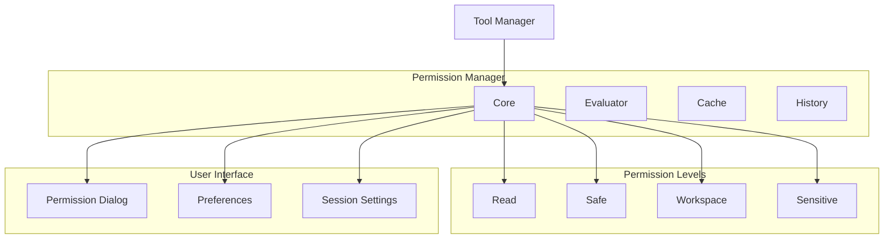
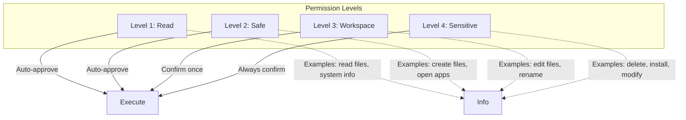
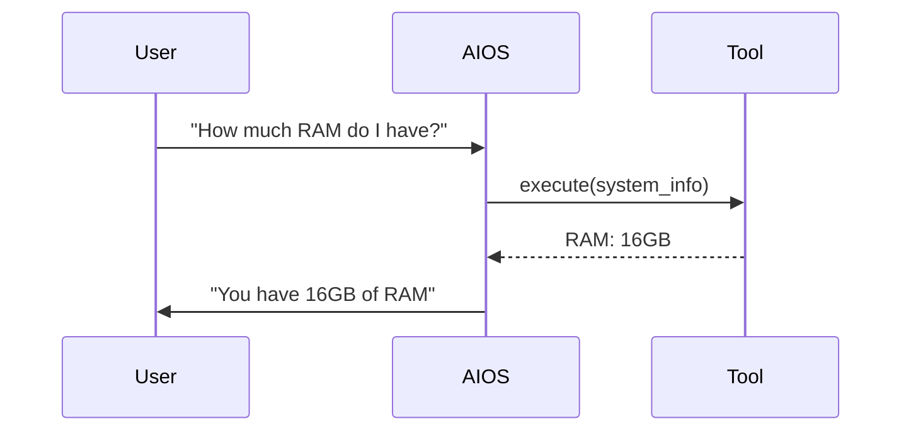
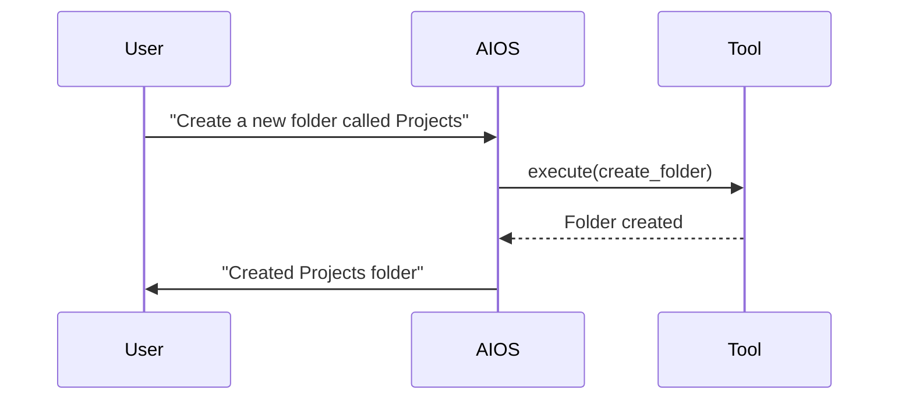
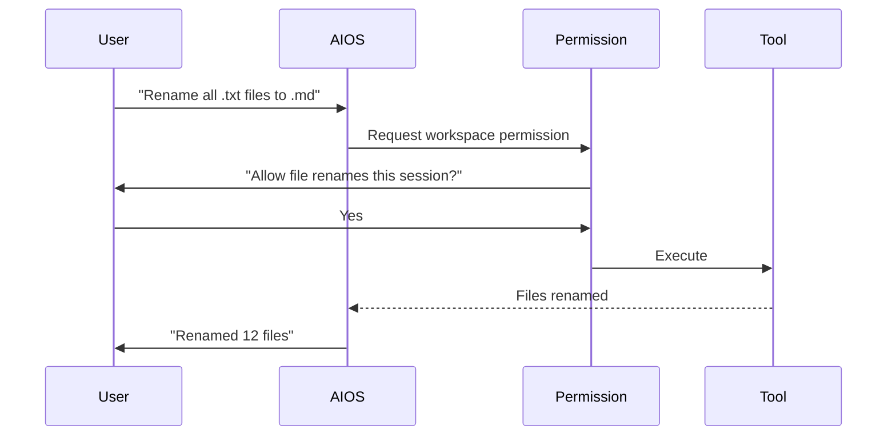
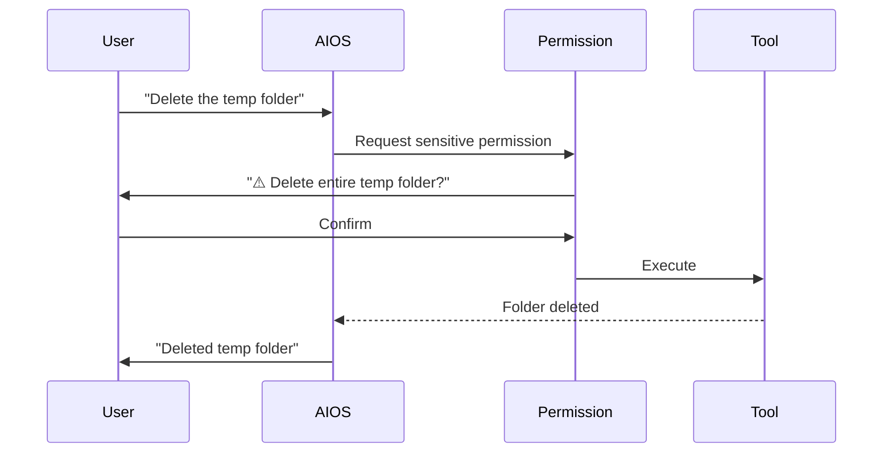

# Permission System

**Document ID:** 11-Permission-System  
**Status:** Approved  
**Version:** 1.0.0  
**Last Updated:** 2026-07-18

---

## 1. Purpose

The Permission System gates all tool execution through configurable permission levels. It ensures that AIOS never performs sensitive actions without appropriate human approval.

## 2. Architecture



## 2. Permission Levels



## 2. Permission Levels

| Level | Name | Auto-approve | Confirmation | Examples |
|-------|------|-------------|--------------|----------|
| 0 | **Read** | Always | None | Read files, system info, clipboard |
| 1 | **Safe** | Always | None | Create files, open apps, web search |
| 2 | **Workspace** | Session | Once per session | Edit files, rename, organize |
| 3 | **Sensitive** | Never | Always required | Delete files, install, modify system |

## 3. Confirmation Flows

### 3.1 Read Level (Auto-approve)



### 3.2 Safe Level (Auto-approve)



### 3.3 Workspace Level (Session Confirm)



### 3.4 Sensitive Level (Always Confirm)



## 4. Permission Configuration

```yaml
permissions:
  default_level: "safe"
  session_timeout: 300  # seconds
  sensitive_actions:
    - delete_files
    - install_software
    - modify_registry
    - execute_commands
  auto_approve:
    - read_file
    - system_info
    - clipboard_read
```

## 5. Public Interface

```python
class PermissionManager:
    async def check_permission(self, tool_id: str, level: PermissionLevel) -> PermissionResult
    async def request_permission(self, request: PermissionRequest) -> PermissionResult
    async def grant_permission(self, request_id: str) -> None
    async def deny_permission(self, request_id: str, reason: str) -> None
    async def get_pending_requests(self) -> list[PermissionRequest]
```

## 6. Implementation Notes

- Permission levels are defined in configuration
- Session permissions expire after timeout
- Sensitive actions always require confirmation
- Permission history is persisted to SQLite
- Users can configure default permissions per tool
