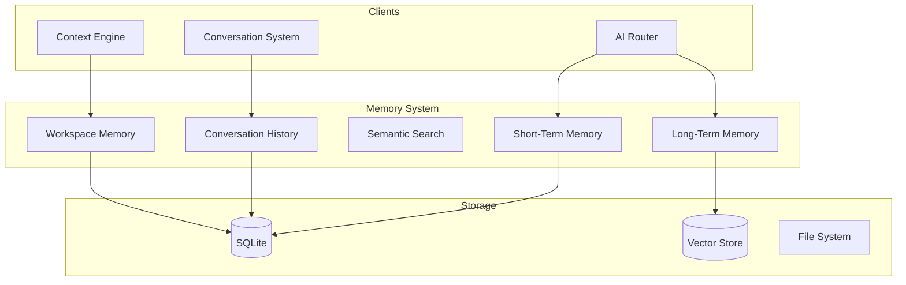

# Memory System

**Document ID:** 12-Memory-System  
**Status:** Approved  
**Version:** 1.0.0  
**Last Updated:** 2026-07-18

---

## 1. Purpose

The Memory System provides AIOS with the ability to remember, recall, and learn from past interactions. It supports short-term, long-term, and semantic memory.

## 2. Architecture



## 2. Memory Types

| Type | Duration | Storage | Purpose |
|------|----------|---------|---------|
| **Short-term** | Session | In-memory | Current conversation context |
| **Long-term** | Permanent | SQLite + Vector | Facts, preferences, learnings |
| **Semantic** | Permanent | Vector DB | Searchable knowledge |
| **Conversation** | Configurable | SQLite | Chat history |
| **Workspace** | Session | SQLite | Current project context |

## 3. Short-Term Memory

```python
@dataclass
class ShortTermMemory:
    conversation_id: str
    messages: list[Message]
    context: Context
    active_tools: list[str]
    current_plan: Plan | None
    expires_at: datetime
```

## 4. Long-Term Memory

```python
@dataclass
class LongTermMemory:
    id: str
    type: MemoryType  # FACT, PREFERENCE, LEARNING, PATTERN
    content: str
    embedding: list[float]
    source: str
    timestamp: datetime
    importance: float  # 0.0 to 1.0
    access_count: int
```

## 5. Semantic Search

```python
class MemorySystem:
    async def store(self, memory: Memory) -> None
    async def search(self, query: str, limit: int = 10) -> list[Memory]
    async def recall(self, memory_id: str) -> Memory
    async def forget(self, memory_id: str) -> None
    async def get_conversation(self, conversation_id: str) -> list[Message]
```

## 6. Memory Types

| Type | Duration | Storage | Purpose |
|------|----------|---------|---------|
| **Short-term** | Session | In-memory | Current conversation context |
| **Long-term** | Permanent | SQLite + Vector | Facts, preferences, learnings |
| **Semantic** | Permanent | Vector DB | Searchable knowledge |
| **Conversation** | Configurable | SQLite | Chat history |
| **Workspace** | Session | SQLite | Current project context |

## 7. Implementation Notes

- Short-term memory is in-memory only
- Long-term memory uses embeddings for semantic search
- Conversation history is pruned after configurable retention
- Memory importance is calculated from frequency and recency
- All memory operations are async
