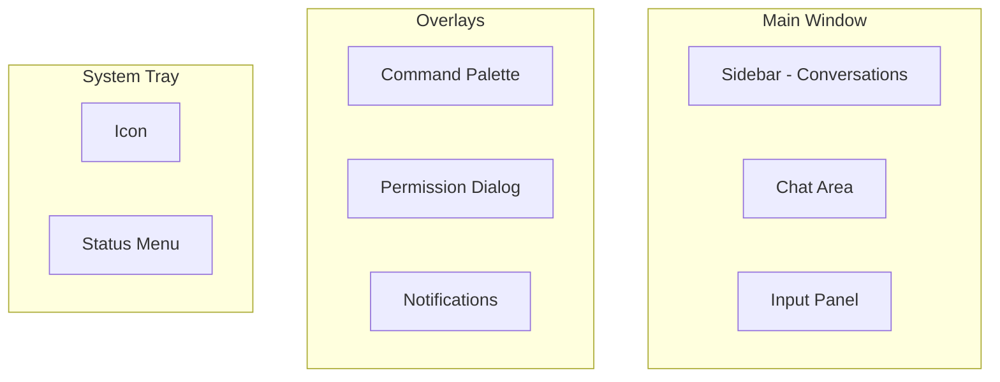

# UI/UX Guidelines

**Document ID:** 15-UI-UX-Guidelines  
**Status:** Approved  
**Version:** 1.0.0  
**Last Updated:** 2026-07-18

---

## 1. Purpose

This document defines the UI/UX guidelines for AIOS, ensuring a consistent, accessible, and delightful user experience.

## 2. Design Principles

- **Invisible when idle** — AIOS stays out of the way until needed
- **Clear communication** — Every action is explained
- **Progressive disclosure** — Show complexity only when needed
- **Consistent patterns** — Same interactions everywhere
- **Accessible by default** — WCAG 2.1 AA compliance

## 3. Layout Principles

## 4. Color System

| Token | Light | Dark | Usage |
|-------|-------|------|-------|
| `--bg-primary` | #FFFFFF | #1A1A2E | Main background |
| `--bg-secondary` | #F5F5F5 | #16213E | Sidebar, cards |
| `--text-primary` | #1A1A2E | #E0E0E0 | Body text |
| `--text-secondary` | #666666 | #A0A0A0 | Secondary text |
| `--accent` | #6C63FF | #7C73FF | Primary accent |
| `--success` | #4CAF50 | #66BB6A | Success states |
| `--warning` | #FF9800 | #FFB74D | Warning states |
| `--error` | #F44336 | #EF5350 | Error states |

## 5. Typography

| Element | Font | Weight | Size |
|---------|------|--------|------|
| Headings | Inter | 600 | 24px |
| Body | Inter | 400 | 14px |
| Code | JetBrains Mono | 400 | 13px |
| Labels | Inter | 500 | 12px |

## 6. Layout Principles

- **Minimal chrome** — UI elements only when needed
- **Content first** — Chat and results take priority
- **Consistent spacing** — 8px grid system
- **Responsive** — Adapts to window size
- **Keyboard-first** — All actions accessible via keyboard
