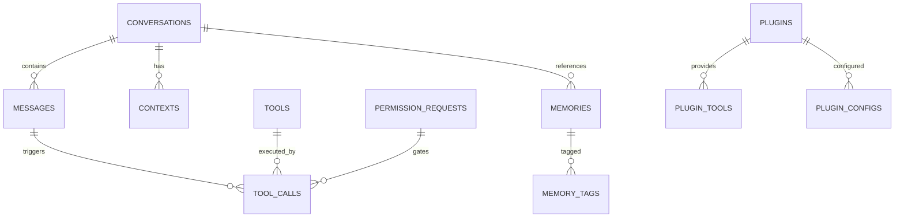

# Database Schema

**Document ID:** 16-Database-Schema  
**Status:** Approved  
**Version:** 1.0.0  
**Last Updated:** 2026-07-18

---

## 1. Purpose

This document defines the complete database schema for AIOS, including all tables, relationships, indexes, and constraints.

## 2. ER Diagram

## 7. Table Definitions

### conversations

| Column | Type | Constraints | Description |
|--------|------|-------------|-------------|
| id | TEXT | PK, UUID | Unique identifier |
| title | TEXT | NOT NULL | Conversation title |
| mode | TEXT | NOT NULL | chat, voice, hybrid |
| created_at | DATETIME | NOT NULL | Creation timestamp |
| updated_at | DATETIME | NOT NULL | Last update |
| is_active | BOOLEAN | DEFAULT true | Active status |

### messages

| Column | Type | Constraints | Description |
|--------|------|-------------|-------------|
| id | TEXT | PK, UUID | Message ID |
| conversation_id | TEXT | FK -> conversations.id | Parent conversation |
| role | TEXT | NOT NULL | user, assistant, system |
| content | TEXT | NOT NULL | Message content |
| timestamp | DATETIME | NOT NULL | Message timestamp |
| tokens_used | INTEGER | DEFAULT 0 | Token count |
| metadata | JSON | DEFAULT {} | Additional data |

### tools

| Column | Type | Constraints | Description |
|--------|------|-------------|-------------|
| id | TEXT | PK | Tool identifier |
| name | TEXT | NOT NULL | Display name |
| description | TEXT | NOT NULL | Tool description |
| permission_level | INTEGER | NOT NULL | 0-3 |
| category | TEXT | NOT NULL | Tool category |
| parameters | JSON | NOT NULL | JSON Schema |
| returns | JSON | NOT NULL | JSON Schema |
| source | TEXT | DEFAULT 'builtin' | builtin, plugin, user |
| enabled | BOOLEAN | DEFAULT true | Active status |

### tool_calls

| Column | Type | Constraints | Description |
|--------|------|-------------|-------------|
| id | TEXT | PK, UUID | Call ID |
| message_id | TEXT | FK -> messages.id | Parent message |
| tool_id | TEXT | FK -> tools.id | Tool used |
| params | JSON | NOT NULL | Call parameters |
| result | JSON | NULL | Execution result |
| status | TEXT | NOT NULL | pending, running, success, failed |
| started_at | DATETIME | NULL | Execution start |
| completed_at | DATETIME | NULL | Execution end |
| error | TEXT | NULL | Error message |

### permission_requests

| Column | Type | Constraints | Description |
|--------|------|-------------|-------------|
| id | TEXT | PK, UUID | Request ID |
| tool_call_id | TEXT | FK -> tool_calls.id | Related tool call |
| level | INTEGER | NOT NULL | Permission level |
| status | TEXT | NOT NULL | pending, granted, denied |
| reason | TEXT | NULL | Denial reason |
| created_at | DATETIME | NOT NULL | Request time |
| resolved_at | DATETIME | NULL | Resolution time |

### memories

| Column | Type | Constraints | Description |
|--------|------|-------------|-------------|
| id | TEXT | PK, UUID | Memory ID |
| type | TEXT | NOT NULL | fact, preference, learning, pattern |
| content | TEXT | NOT NULL | Memory content |
| embedding | BLOB | NULL | Vector embedding |
| importance | REAL | DEFAULT 0.5 | 0.0 to 1.0 |
| source | TEXT | NOT NULL | Module that created it |
| conversation_id | TEXT | FK -> conversations.id | Related conversation |
| created_at | DATETIME | NOT NULL | Creation time |
| accessed_at | DATETIME | NOT NULL | Last access time |
| access_count | INTEGER | DEFAULT 0 | Access frequency |

### memory_tags

| Column | Type | Constraints | Description |
|--------|------|-------------|-------------|
| id | TEXT | PK, UUID | Tag ID |
| memory_id | TEXT | FK -> memories.id | Related memory |
| tag | TEXT | NOT NULL | Tag value |

### plugins

| Column | Type | Constraints | Description |
|--------|------|-------------|-------------|
| id | TEXT | PK | Plugin identifier |
| name | TEXT | NOT NULL | Display name |
| version | TEXT | NOT NULL | Semantic version |
| author | TEXT | NOT NULL | Plugin author |
| description | TEXT | NOT NULL | Plugin description |
| manifest | JSON | NOT NULL | Full manifest |
| enabled | BOOLEAN | DEFAULT true | Active status |
| installed_at | DATETIME | NOT NULL | Install time |

### plugin_tools

| Column | Type | Constraints | Description |
|--------|------|-------------|-------------|
| id | TEXT | PK | Tool identifier |
| plugin_id | TEXT | FK -> plugins.id | Parent plugin |
| name | TEXT | NOT NULL | Tool name |
| description | TEXT | NOT NULL | Tool description |
| permission_level | INTEGER | NOT NULL | Required level |
| parameters | JSON | NOT NULL | JSON Schema |
| enabled | BOOLEAN | DEFAULT true | Active status |

### plugin_configs

| Column | Type | Constraints | Description |
|--------|------|-------------|-------------|
| id | TEXT | PK, UUID | Config ID |
| plugin_id | TEXT | FK -> plugins.id | Parent plugin |
| key | TEXT | NOT NULL | Config key |
| value | TEXT | NOT NULL | Config value |
| UNIQUE(plugin_id, key) | | | Unique per plugin |

### contexts

| Column | Type | Constraints | Description |
|--------|------|-------------|-------------|
| id | TEXT | PK, UUID | Context ID |
| conversation_id | TEXT | FK -> conversations.id | Related conversation |
| active_app | TEXT | NULL | Foreground application |
| active_window | TEXT | NULL | Window title |
| active_file | TEXT | NULL | Currently open file |
| project_path | TEXT | NULL | Detected project path |
| activity | TEXT | NULL | Detected activity type |
| metadata | JSON | DEFAULT {} | Additional context |
| captured_at | DATETIME | NOT NULL | Capture timestamp |

### events

| Column | Type | Constraints | Description |
|--------|------|-------------|-------------|
| id | TEXT | PK, UUID | Event ID |
| type | TEXT | NOT NULL | Event type |
| source | TEXT | NOT NULL | Source module |
| payload | JSON | NOT NULL | Event data |
| correlation_id | TEXT | NULL | Trace ID |
| priority | INTEGER | DEFAULT 0 | Priority level |
| status | TEXT | DEFAULT 'created' | created, queued, delivered, failed |
| retry_count | INTEGER | DEFAULT 0 | Retry attempts |
| created_at | DATETIME | NOT NULL | Creation time |
| delivered_at | DATETIME | NULL | Delivery time |

### settings

| Column | Type | Constraints | Description |
|--------|------|-------------|-------------|
| key | TEXT | PK | Setting key |
| value | TEXT | NOT NULL | Setting value |
| category | TEXT | NOT NULL | Setting category |
| updated_at | DATETIME | NOT NULL | Last update |

## 4. Indexes

| Table | Index | Columns | Purpose |
|-------|-------|---------|---------|
| messages | idx_messages_conversation | conversation_id, timestamp | Fast conversation loading |
| messages | idx_messages_timestamp | timestamp | Time-based queries |
| tool_calls | idx_tool_calls_message | message_id | Tool call lookup |
| tool_calls | idx_tool_calls_status | status | Status filtering |
| memories | idx_memories_type | type | Memory type queries |
| memories | idx_memories_importance | importance | Importance sorting |
| contexts | idx_contexts_conversation | conversation_id | Context lookup |
| events | idx_events_type | type | Event filtering |
| events | idx_events_status | status | Event status queries |

## 5. Constraints

| Constraint | Table | Columns | Rule |
|------------|-------|---------|------|
| PK | All | id | Primary key |
| FK | messages | conversation_id | CASCADE on delete |
| FK | tool_calls | message_id | CASCADE on delete |
| FK | contexts | conversation_id | CASCADE on delete |
| FK | memories | conversation_id | SET NULL on delete |
| FK | memory_tags | memory_id | CASCADE on delete |
| FK | plugin_tools | plugin_id | CASCADE on delete |
| FK | plugin_configs | plugin_id | CASCADE on delete |
| UNIQUE | plugin_configs | (plugin_id, key) | Unique config per plugin |

## 6. Relationships

- A **conversation** has many **messages**
- A **message** can have many **tool_calls**
- A **tool_call** has one **permission_request**
- A **conversation** has many **contexts**
- A **conversation** has many **memories**
- A **memory** has many **memory_tags**
- A **plugin** has many **plugin_tools** and **plugin_configs**

## 7. Implementation Notes

- All timestamps are ISO 8601 UTC
- UUIDs are v4
- JSON columns use SQLite JSON1 extension
- Foreign keys use CASCADE for related data
- Indexes are created for all foreign keys and frequently queried columns
