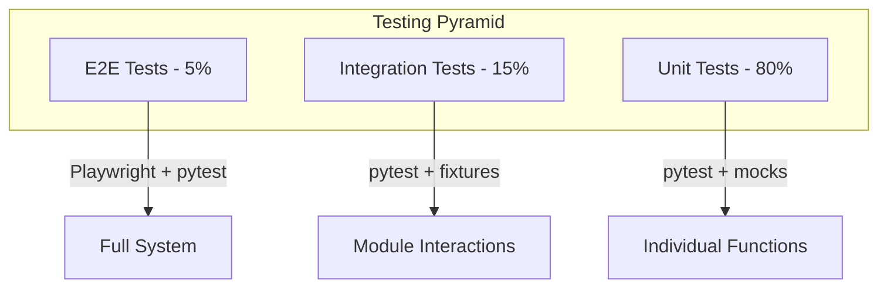

# Testing Strategy

**Document ID:** 18-Testing-Strategy  
**Status:** Approved  
**Version:** 1.0.0  
**Last Updated:** 2026-07-18

---

## 1. Purpose

This document defines the testing strategy for AIOS, covering all levels of testing from unit to end-to-end.

## 2. Testing Pyramid

## 3. Unit Testing

| Module | Framework | Coverage Target |
|--------|-----------|-----------------|
| Event Bus | pytest-asyncio | 95% |
| AI Router | pytest + mocks | 90% |
| Planner | pytest + mocks | 90% |
| Tool Manager | pytest + mocks | 95% |
| Permission Manager | pytest | 95% |
| Memory System | pytest | 90% |
| Context Engine | pytest | 90% |

## 4. Integration Testing

| Test | Description |
|------|-------------|
| Conversation Flow | Full chat cycle with tool execution |
| Permission Flow | Permission request, grant, deny cycle |
| Plugin System | Plugin load, register, execute |
| Memory System | Store, search, recall cycle |
| Event Bus | Publish, subscribe, delivery |

## 5. End-to-End Testing

- Playwright for UI automation
- Full conversation scenarios
- Permission dialog interactions
- Plugin installation and usage
- System tray interactions

## 6. Performance Testing

| Test | Target |
|------|--------|
| Chat response time | < 2s |
| Tool execution | < 1s |
| Memory search | < 500ms |
| Concurrent conversations | 10+ |
| Startup time | < 3s |

## 7. Security Testing

- Permission bypass attempts
- Plugin sandbox escape
- SQL injection
- Path traversal
- Command injection
- AI prompt injection
