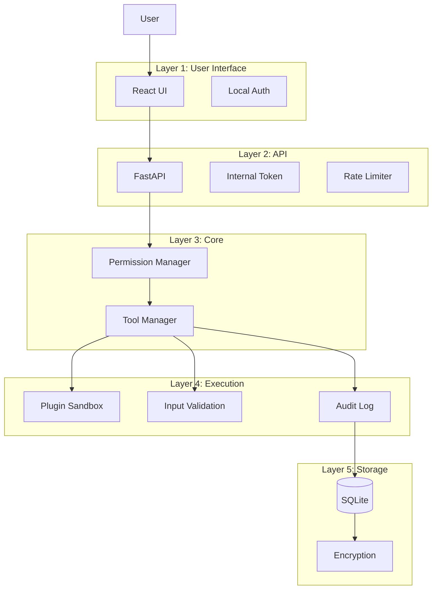

# Security Architecture

**Document ID:** 19-Security-Architecture  
**Status:** Approved  
**Version:** 1.0.0  
**Last Updated:** 2026-07-18

---

## 1. Purpose

This document defines the security architecture for AIOS, covering permissions, data storage, encryption, secrets management, and plugin security.

## 2. Security Principles

- **Least privilege** — Modules only have access to what they need
- **Defense in depth** — Multiple layers of security
- **Local-first** — Data stays on device by default
- **Transparent** — Users know what AIOS is doing
- **Auditable** — All actions are logged

## 3. Security Layers

## 4. Data Storage Security

- SQLite database is encrypted at rest
- API keys stored in OS keychain (Windows Credential Manager)
- Configuration files are not committed to version control
- Memory data is encrypted
- Plugin data is isolated

## 5. Secrets Management

| Secret | Storage | Encryption |
|--------|---------|------------|
| AI API keys | Windows Credential Manager | OS-level |
| Database | SQLite | AES-256-GCM |
| Config | YAML file | File permissions |
| Plugin tokens | Plugin config store | AES-256-GCM |

## 6. Plugin Sandboxing

- Plugins run in isolated subprocess
- Limited file system access
- No direct network access
- Memory limits enforced
- CPU limits enforced
- Timeout enforced
