# Windows Adapter

**Document ID:** 20-Windows-Adapter  
**Status:** Approved  
**Version:** 1.0.0  
**Last Updated:** 2026-07-18

---

## 1. Purpose

The Windows Adapter is the abstraction layer between AIOS and the Windows operating system. It provides a safe, controlled interface for all OS interactions without modifying Windows itself.

## 2. Architecture

```mermaid
graph TB
    subgraph "Windows Adapter"
        WA[Adapter Core]
        FS[File System]
        PROC[Process Manager]
        REG[Registry Reader]
        NET[Network Info]
        UI[UI Automation]
    end

    subgraph "Windows APIs"
        WIN32[Win32 API]
        POW[PowerShell]
        WMI[WMI]
        UIA[UI Automation]
    end

    subgraph "AIOS Tools"
        TM[Tool Manager]
    end

    TM --> WA
    WA --> FS
    WA --> PROC
    WA --> REG
    WA --> NET
    WA --> UI
    FS --> WIN32
    PROC --> WMI
    REG --> WIN32
    UI --> UIA
```



## 4. Core Principle

**AIOS never modifies Windows.** The Windows Adapter is a read-first, write-safe abstraction layer.

## 5. Capabilities

| Capability | Implementation | Read | Write |
|------------|---------------|------|-------|
| File System | os, pathlib, shutil | ✓ | ✓ |
| Process Management | psutil | ✓ | ✓ |
| System Info | psutil, platform | ✓ | ✗ |
| Registry | winreg (read-only) | ✓ | ✗ |
| UI Automation | PyAutoGUI | ✓ | ✓ |
| Web Automation | Playwright | ✓ | ✓ |
| Clipboard | pyperclip | ✓ | ✓ |
| Network | psutil, socket | ✓ | ✗ |

## 6. Public Interface

```python
class WindowsAdapter:
    # File System
    async def search_files(self, pattern: str, path: str = None) -> list[FileInfo]
    async def read_file(self, path: str) -> str
    async def write_file(self, path: str, content: str) -> None
    async def delete_file(self, path: str) -> None
    async def create_directory(self, path: str) -> None

    # Process Management
    async def list_processes(self) -> list[ProcessInfo]
    async def get_process_info(self, pid: int) -> ProcessInfo
    async def start_process(self, command: str) -> int
    async def kill_process(self, pid: int) -> None

    # System Information
    async def get_system_info(self) -> SystemInfo
    async def get_disk_usage(self) -> list[DiskInfo]
    async def get_network_info(self) -> NetworkInfo

    # UI Automation
    async def get_active_window(self) -> WindowInfo
    async def get_screenshot(self) -> bytes
    async def click(self, x: int, y: int) -> None
    async def type_text(self, text: str) -> None
    async def get_clipboard(self) -> str
    async def set_clipboard(self, text: str) -> None
```

## 4. Implementation Notes

- All Windows API calls go through the adapter
- The adapter validates all inputs before execution
- Write operations are logged and permission-gated
- Read operations are logged but auto-approved
- The adapter never modifies Windows registry or system files
