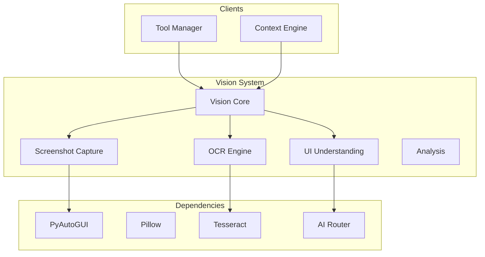

# Vision System

**Document ID:** 21-Vision-System  
**Status:** Approved  
**Version:** 1.0.0  
**Last Updated:** 2026-07-18

---

## 1. Purpose

The Vision System provides AIOS with the ability to see and understand the user's screen through screenshots, OCR, and UI element detection.

## 2. Architecture



## 5. Capabilities

| Capability | Tool | Permission Level |
|------------|------|-----------------|
| Screenshot capture | PyAutoGUI | Read |
| OCR text extraction | Tesseract | Read |
| UI element detection | AI Vision | Read |
| Active window info | Win32 API | Read |
| Screen recording | OpenCV | Sensitive |

## 6. Public Interface

```python
class VisionSystem:
    async def capture_screen(self, region: tuple = None) -> Image
    async def extract_text(self, image: Image) -> str
    async def find_element(self, image: Image, description: str) -> Element
    async def get_active_window_info(self) -> WindowInfo
    async def detect_ui_elements(self, image: Image) -> list[UIElement]
```

## 7. Implementation Notes

- Screenshots are captured via PyAutoGUI
- OCR uses Tesseract
- UI element detection uses AI vision models
- Screenshots are never stored by default
- All vision operations are read-only
