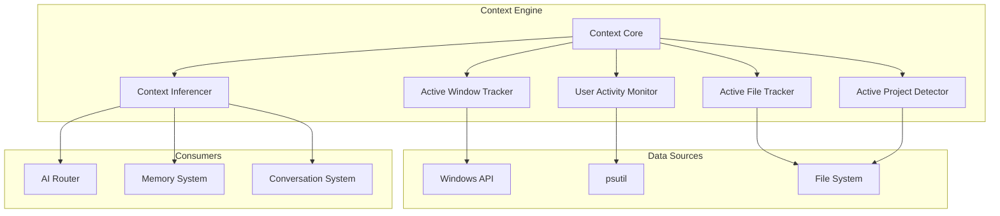

# Context Engine

**Document ID:** 22-Context-Engine  
**Status:** Approved  
**Version:** 1.0.0  
**Last Updated:** 2026-07-18

---

## 1. Purpose

The Context Engine tracks the user's current activity, active applications, open files, and project context to provide AIOS with situational awareness.

## 2. Architecture



## 8. Context Data

```python
@dataclass
class Context:
    active_app: str | None
    active_window: str | None
    active_file: str | None
    project_path: str | None
    project_type: str | None  # "python", "node", "rust", etc.
    recent_files: list[str]
    open_applications: list[str]
    activity: str  # "coding", "writing", "browsing", "idle"
    timestamp: datetime
```

## 9. Public Interface

```python
class ContextEngine:
    async def get_current_context(self) -> Context
    async def get_active_app(self) -> str
    async def get_active_file(self) -> str | None
    async def detect_project(self) -> ProjectInfo | None
    async def get_recent_activity(self, minutes: int = 5) -> list[Activity]
    async def subscribe_context_changes(self, handler: Callable) -> None
```

## 10. Implementation Notes

- Context is polled every 2 seconds
- Changes are published via Event Bus
- Active file detection uses window title parsing
- Project detection uses common project markers (package.json, .git, etc.)
- Context is persisted to SQLite for session continuity
