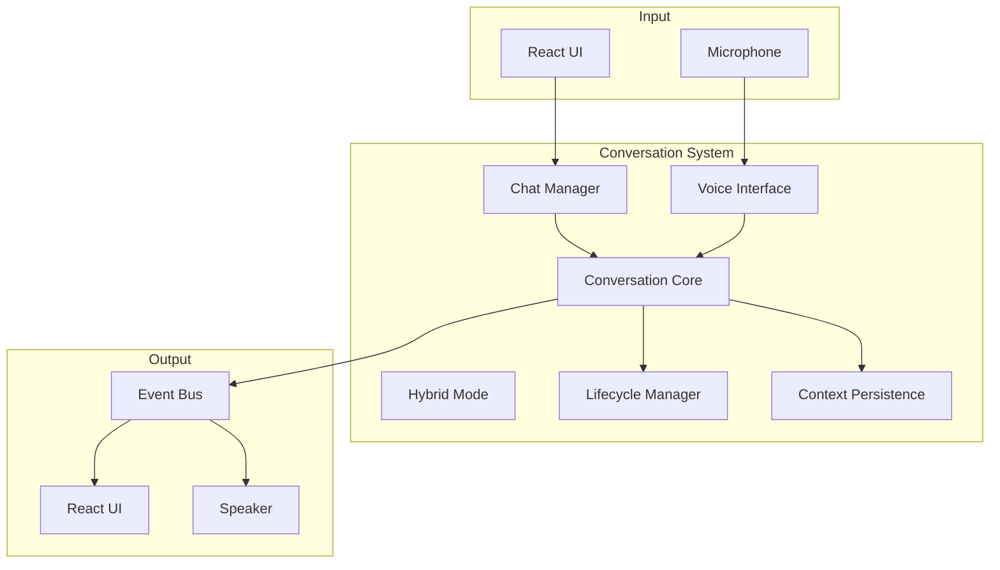
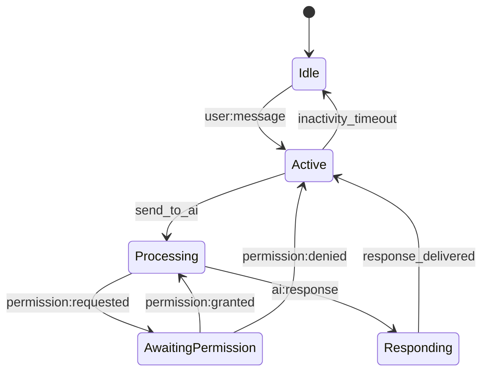

# Conversation System

**Document ID:** 23-Conversation-System  
**Status:** Approved  
**Version:** 1.0.0  
**Last Updated:** 2026-07-18

---

## 1. Purpose

The Conversation System manages the lifecycle of user interactions with AIOS, supporting chat, voice, and hybrid communication modes.

## 2. Architecture



## 11. Conversation Lifecycle



## 12. Public Interface

```python
class ConversationSystem:
    async def send_message(self, content: str, mode: str = "chat") -> Message
    async def stream_message(self, content: str) -> AsyncIterator[StreamEvent]
    async def get_history(self, conversation_id: str) -> list[Message]
    async def create_conversation(self, title: str = None) -> Conversation
    async def delete_conversation(self, conversation_id: str) -> None
    async def switch_mode(self, mode: str) -> None
```

## 13. Implementation Notes

- Conversations are persisted to SQLite
- Context is attached to every message
- Voice mode uses system microphone
- Hybrid mode allows switching mid-conversation
- Conversation history is searchable
