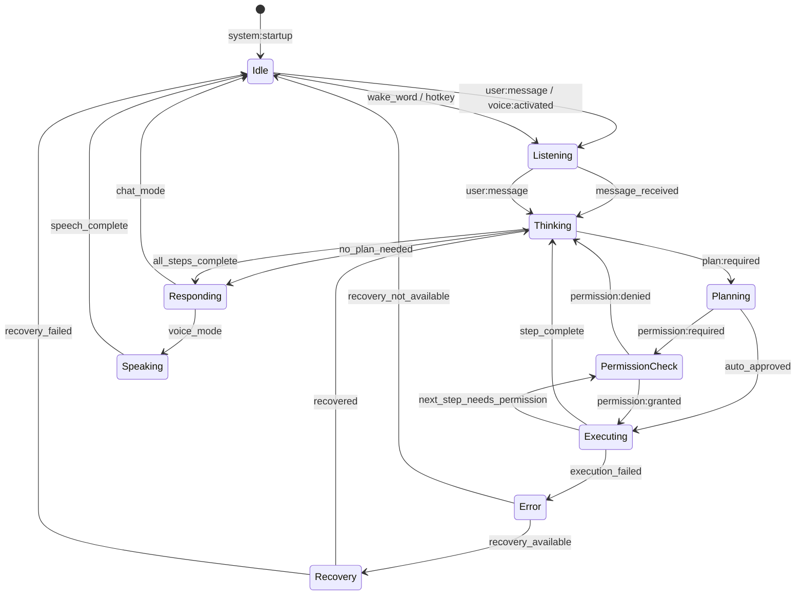
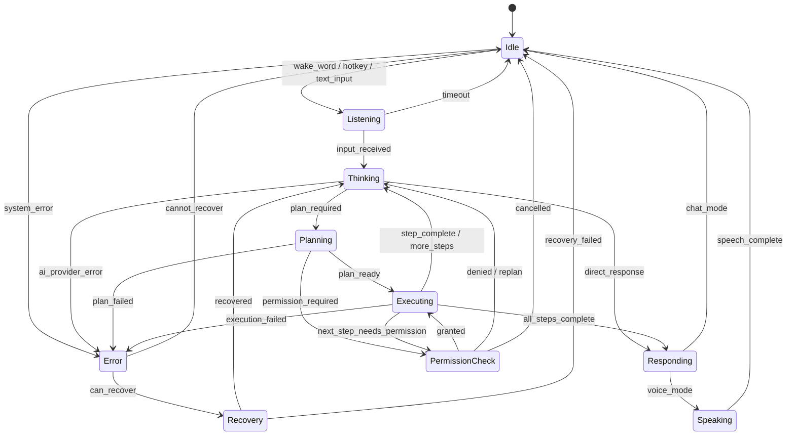
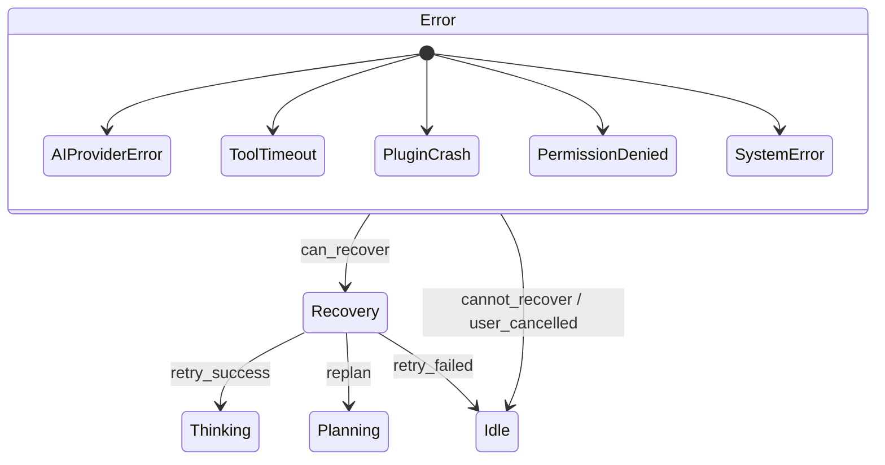

# State Machine

**Document ID:** 26-State-Machine  
**Status:** Approved  
**Version:** 1.0.0  
**Last Updated:** 2026-07-18

---

## 1. Purpose

This document defines the complete AIOS lifecycle state machine, covering all system states, transitions, and recovery paths.

## 2. AIOS Lifecycle State Machine

## 3. State Definitions

| State | Description | Duration | User-Facing |
|-------|-------------|----------|-------------|
| **Idle** | AIOS is running but inactive. Waiting for wake word or hotkey. | Indefinite | System tray icon only |
| **Listening** | Actively listening for user input (voice or text) | Until input received | Microphone indicator |
| **Thinking** | Processing input through AI Router | Variable | "Thinking..." indicator |
| **Planning** | Decomposing task into executable steps | Variable | "Planning..." indicator |
| **Permission Check** | Awaiting user approval for sensitive action | Until user responds | Permission dialog |
| **Executing** | Running tools and system actions | Variable | Progress indicator |
| **Speaking** | Voice output active | Until speech complete | Voice waveform |
| **Waiting** | Paused for user input mid-workflow | Until user responds | Paused indicator |
| **Error** | An error occurred during processing | Until recovered | Error display |
| **Recovery** | Attempting to recover from error | Variable | Recovery indicator |

## 4. State Transitions

## 4. State Properties

| State | Timeout | Auto-Recovery | User Notification |
|-------|---------|---------------|-------------------|
| Idle | None | N/A | None |
| Listening | 30s | Return to Idle | Microphone icon |
| Thinking | 60s | Retry AI provider | "Thinking..." |
| Planning | 30s | Re-plan with fewer steps | "Planning..." |
| Permission Check | 300s | Deny on timeout | Permission dialog |
| Executing | Varies per tool | Retry or fail | Progress indicator |
| Speaking | Until complete | N/A | Voice waveform |
| Waiting | 120s | Cancel workflow | "Waiting..." |
| Error | Until recovered | Auto-recovery | Error message |
| Recovery | 30s | Return to Idle | "Recovering..." |

## 4. State Transition Rules

| Rule | Description |
|------|-------------|
| **Single active state** | Only one state active at a time |
| **Timeout enforcement** | Every state has a maximum duration |
| **Error dominance** | Any state can transition to Error |
| **Recovery priority** | Recovery always attempts before Idle |
| **User interrupt** | User can cancel any state and return to Idle |
| **State logging** | Every transition is logged |

## 5. Error States

## 6. Implementation Notes

- State transitions are published as events on the Event Bus
- Each state has a configurable timeout
- Error states are logged with full context
- Recovery strategies are registered per error type
- State history is persisted for debugging
