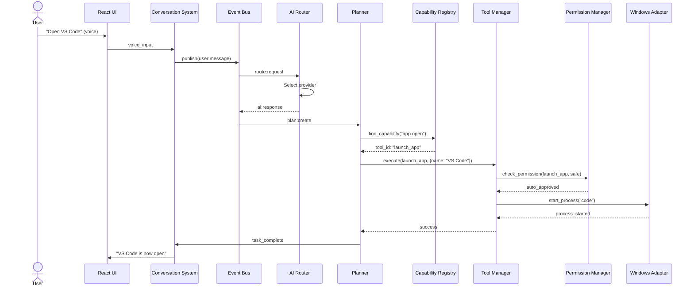
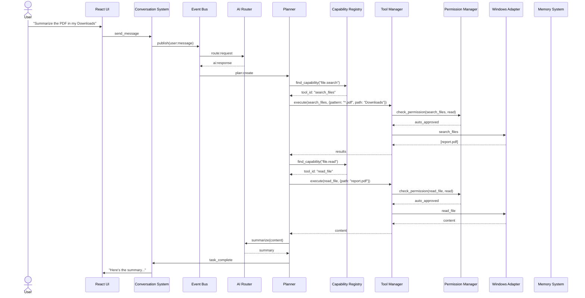
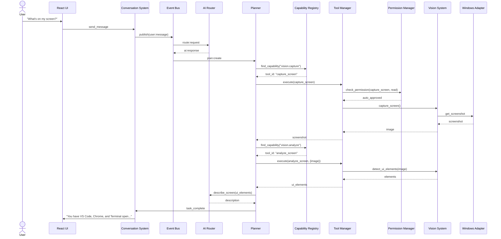
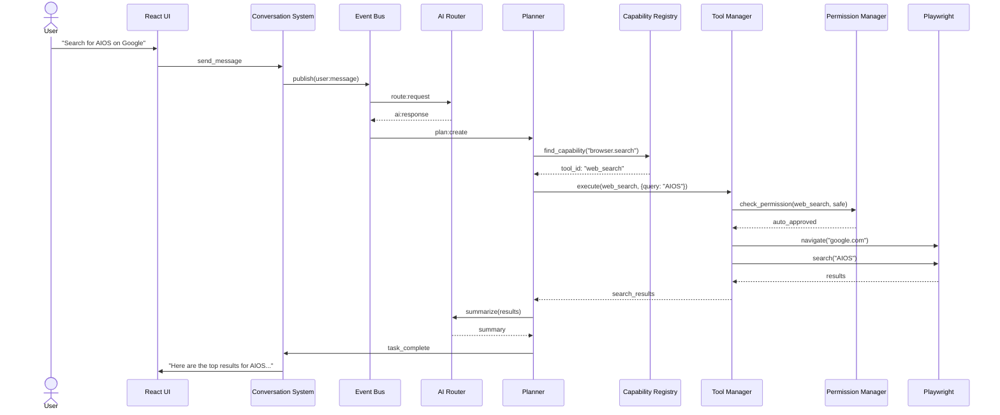
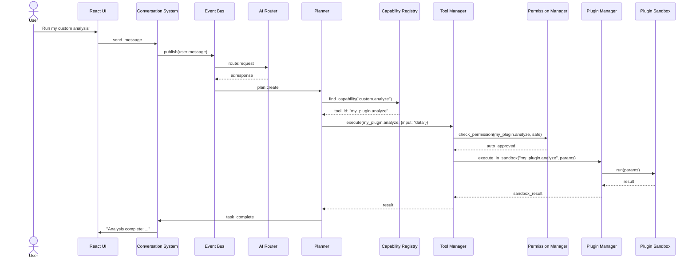
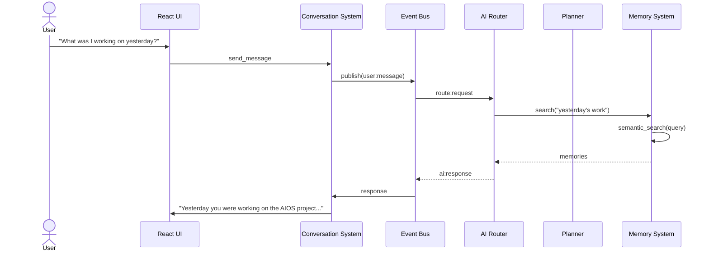
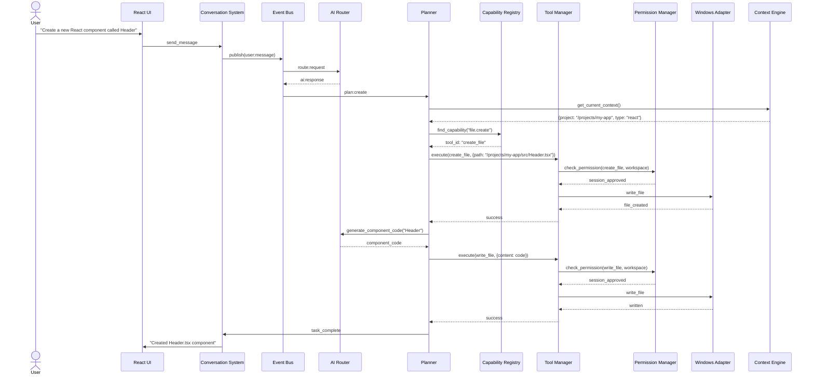

# Sequence Diagrams

**Document ID:** 27-Sequence-Diagrams  
**Status:** Approved  
**Version:** 1.0.0  
**Last Updated:** 2026-07-18

---

## 1. Purpose

This document provides end-to-end sequence diagrams for key AIOS workflows, serving as the definitive reference for system behavior.

## 2. Voice → Open VS Code

## 3. Chat → Summarize PDF

## 4. Screenshot → UI Analysis

## 5. Browser Automation

## 6. Plugin Execution

## 7. Memory Retrieval

## 8. Coding Workflow

## 9. Implementation Notes

- All diagrams incorporate the Capability Registry as the discovery layer
- Permission checks are shown at their actual level
- Error paths are omitted for clarity (see 28-Error-Recovery.md)
- All inter-module communication goes through the Event Bus
- The Planner never knows specific tool IDs — it always queries capabilities
