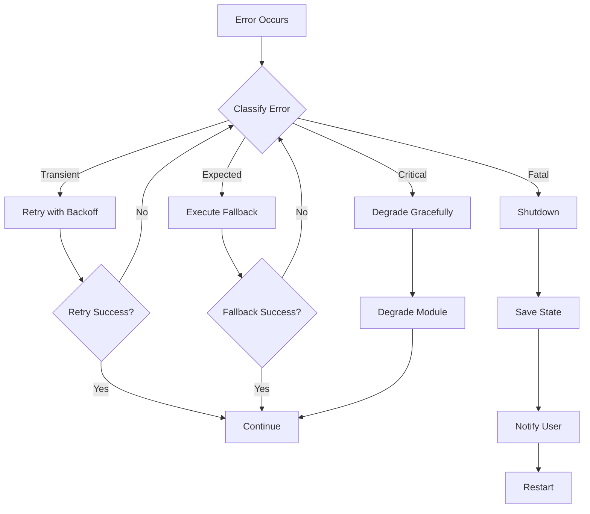
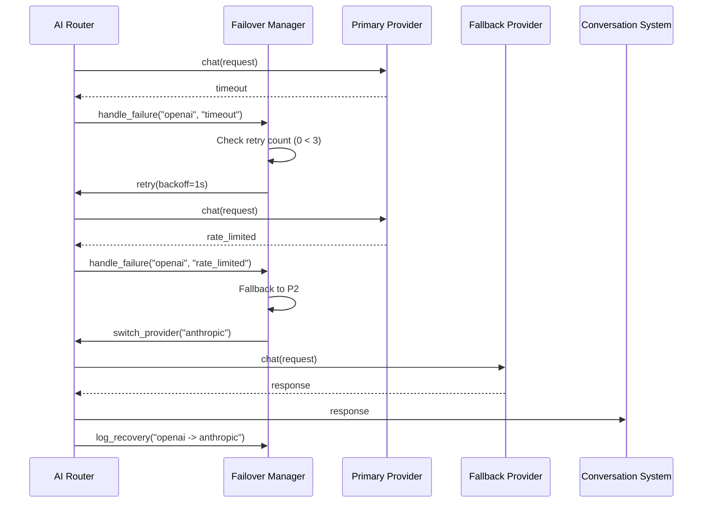
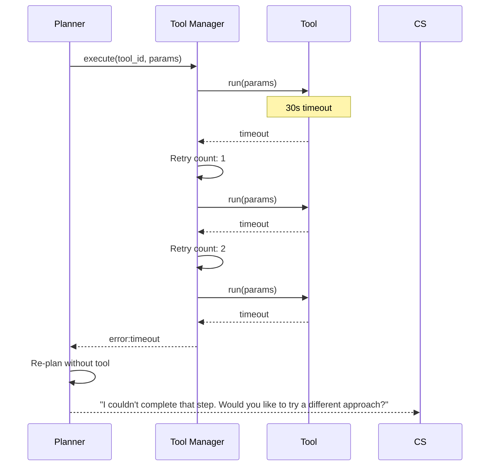
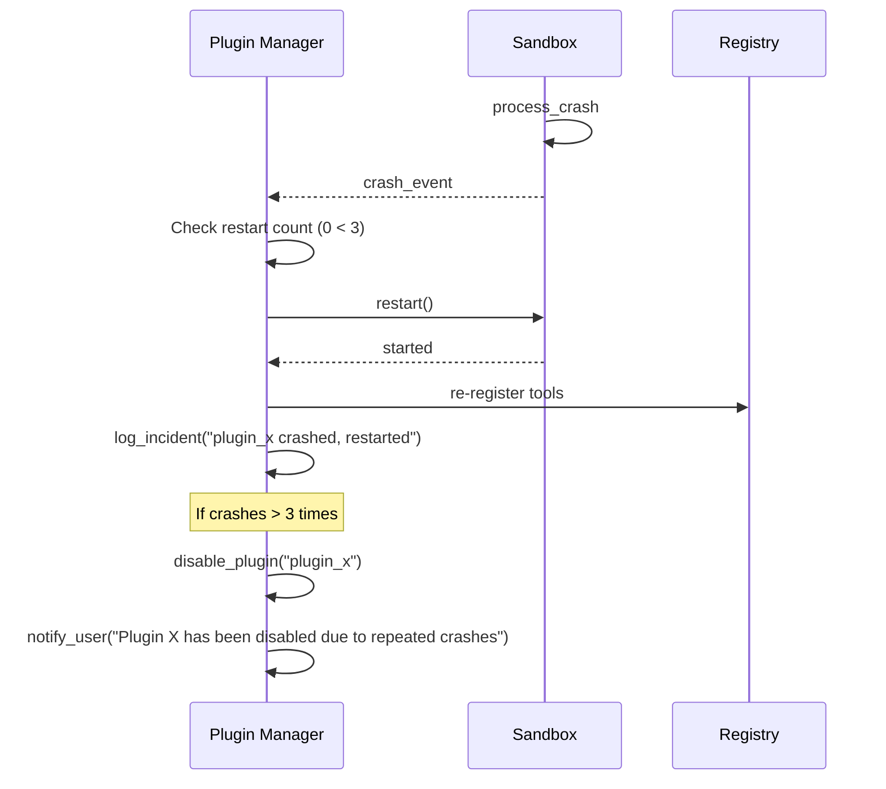

# Error Recovery

**Document ID:** 28-Error-Recovery  
**Status:** Approved  
**Version:** 1.0.0  
**Last Updated:** 2026-07-18

---

## 1. Purpose

This document defines error recovery strategies for all AIOS modules, ensuring graceful degradation and transparent failure handling.

## 2. Error Classification

| Class | Severity | Recovery | User Impact |
|-------|----------|----------|-------------|
| **Transient** | Low | Auto-retry | None |
| **Expected** | Medium | Fallback path | Minimal |
| **Critical** | High | Graceful degradation | Noticeable |
| **Fatal** | Critical | Shutdown | Full impact |

## 3. Error Recovery Matrix

| Error Source | Error Type | Classification | Recovery Strategy | Fallback |
|-------------|------------|---------------|-------------------|----------|
| **AI Provider** | Timeout | Transient | Retry with backoff | Switch provider |
| **AI Provider** | Rate limited | Expected | Queue and wait | Switch provider |
| **AI Provider** | Authentication | Critical | Notify user | Disable provider |
| **Tool** | Timeout | Transient | Retry (3x) | Skip step |
| **Tool** | Not found | Expected | Re-plan | Remove step |
| **Tool** | Permission denied | Expected | Ask user | Cancel step |
| **Plugin** | Crash | Expected | Restart sandbox | Disable plugin |
| **Plugin** | Memory overflow | Critical | Kill sandbox | Disable plugin |
| **Plugin** | Hang | Expected | Force kill | Disable plugin |
| **Windows API** | Call failed | Transient | Retry (2x) | Return error |
| **Windows API** | Access denied | Expected | Log and notify | Skip operation |
| **Windows API** | Not supported | Expected | Log and notify | Skip operation |
| **Browser** | Navigation failed | Transient | Retry (2x) | Return error |
| **Browser** | Element not found | Expected | Wait and retry | Return error |
| **Browser** | Timeout | Transient | Retry with longer timeout | Return error |
| **OCR** | No text found | Expected | Return empty | Skip OCR |
| **OCR** | Engine error | Transient | Retry (2x) | Skip OCR |
| **OCR** | Image corrupt | Expected | Request new screenshot | Skip OCR |
| **Memory** | Corrupt entry | Expected | Delete entry | Continue |
| **Memory** | Search failed | Transient | Retry | Return empty |
| **Memory** | Store failed | Transient | Retry | Skip storage |
| **Network** | No connection | Expected | Queue requests | Offline mode |
| **Network** | DNS failure | Transient | Retry with alternative DNS | Offline mode |
| **Network** | Packet loss | Transient | Retry | Degrade quality |
| **System** | Out of memory | Critical | Clear caches | Graceful shutdown |
| **System** | Disk full | Critical | Notify user | Stop write operations |
| **System** | Unexpected exception | Fatal | Log and restart | Graceful shutdown |

## 3. Recovery Flow



## 3. AI Provider Failure Recovery



## 3. Tool Timeout Recovery



## 3. Plugin Crash Recovery



## 4. Recovery Configuration

```yaml
recovery:
  max_retries: 3
  backoff_strategy: "exponential"
  backoff_base_seconds: 1
  backoff_max_seconds: 30

  ai_provider:
    max_retries: 3
    failover_enabled: true
    circuit_breaker:
      failure_threshold: 5
      reset_timeout: 60

  tools:
    max_retries: 3
    timeout: 30
    circuit_breaker:
      failure_threshold: 10
      reset_timeout: 120

  plugins:
    max_crashes: 3
    auto_disable: true
    memory_limit_mb: 256

  network:
    offline_mode: true
    queue_requests: true
    max_queue_size: 100
```

## 5. Implementation Notes

- Every module reports errors via the Event Bus
- Recovery strategies are registered at module initialization
- Circuit breakers prevent cascading failures
- All recovery actions are logged
- Users are notified of all critical and fatal errors
