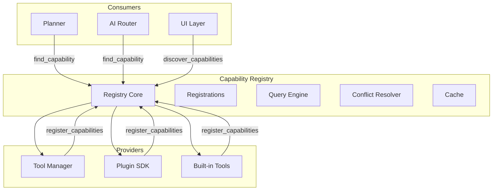
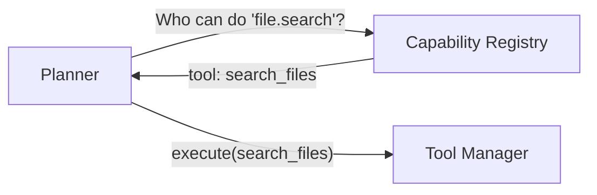
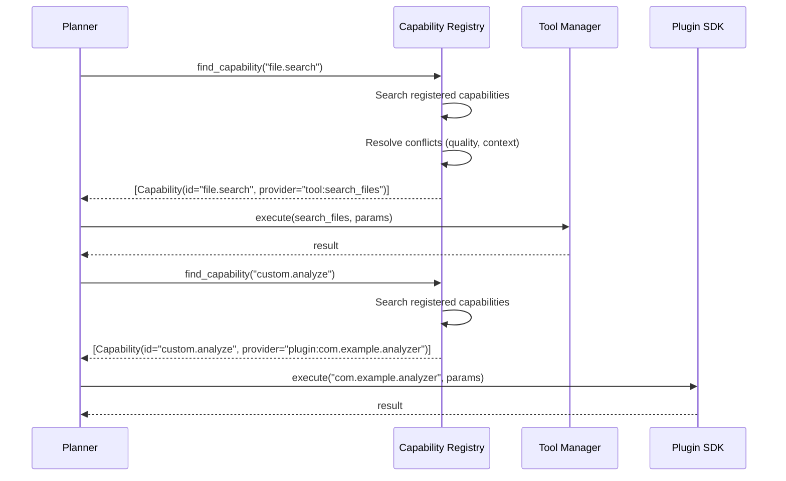
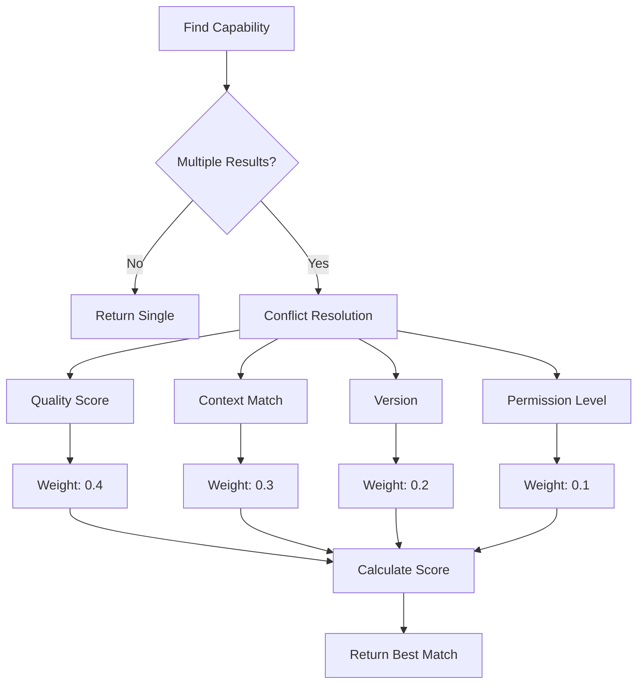

# Capability Registry

**Document ID:** 29-Capability-Registry  
**Status:** Approved  
**Version:** 1.0.0  
**Last Updated:** 2026-07-18

---

## 1. Purpose

The Capability Registry is the discovery layer of AIOS. It decouples the Planner from specific tools by providing a capability-based abstraction: the Planner asks "who can perform this capability?" and receives the best matching tool or plugin.

## 2. Architecture



## 2. Concept

**Without Capability Registry (tight coupling):**


**With Capability Registry (loose coupling):**



## 2. Capability Definition

```python
@dataclass
class Capability:
    id: str                    # "file.search", "app.open"
    name: str                  # "Search Files"
    description: str           # "Search for files by name, type, or size"
    provider_type: str         # "tool", "plugin", "builtin"
    provider_id: str           # Tool ID or Plugin ID
    parameters: dict           # JSON Schema for parameters
    returns: dict              # JSON Schema for return values
    permission_level: int      # 0-3
    tags: list[str]            # ["file", "search", "read"]
    version: str               # Semver
    quality: float             # 0.0 to 1.0 confidence ranking
```

## 2. Capability Examples

| Capability ID | Provider | Permission | Description |
|--------------|----------|------------|-------------|
| `file.search` | Tool Manager | Read | Search files by pattern, size, date |
| `file.read` | Tool Manager | Read | Read file contents |
| `file.create` | Tool Manager | Workspace | Create new files |
| `file.delete` | Tool Manager | Sensitive | Delete files |
| `file.compress` | Tool Manager | Safe | Compress files |
| `app.open` | Tool Manager | Safe | Launch applications |
| `app.list` | Tool Manager | Read | List running applications |
| `system.info` | Tool Manager | Read | Get system information |
| `system.processes` | Tool Manager | Read | List running processes |
| `clipboard.read` | Tool Manager | Read | Read clipboard content |
| `clipboard.write` | Tool Manager | Safe | Write to clipboard |
| `vision.capture` | Vision System | Read | Capture screenshot |
| `vision.ocr` | Vision System | Read | Extract text from image |
| `vision.analyze` | Vision System | Read | Analyze UI elements |
| `browser.search` | Browser Tool | Safe | Search the web |
| `browser.navigate` | Browser Tool | Safe | Navigate to URL |
| `browser.scrape` | Browser Tool | Safe | Extract page content |
| `code.edit` | Code Tool | Workspace | Edit source files |
| `code.run` | Code Tool | Safe | Run code/commands |
| `memory.store` | Memory System | Read | Store in memory |
| `memory.search` | Memory System | Read | Search memories |
| `context.get` | Context Engine | Read | Get current context |
| `plugin.execute` | Plugin Manager | Varies | Execute plugin tool |

## 3. Registration

```python
class CapabilityRegistry:
    async def register_capability(self, capability: Capability) -> None
    async def unregister_capability(self, capability_id: str) -> None
    async def register_provider(self, provider_type: str, provider: CapabilityProvider) -> None
```

Tools and plugins register capabilities at initialization:

```python
# Tool Manager registers its capabilities
await capability_registry.register_capability(
    Capability(
        id="file.search",
        name="Search Files",
        description="Search for files by name, type, or size",
        provider_type="tool",
        provider_id="search_files",
        parameters={...},
        returns={...},
        permission_level=0,
        tags=["file", "search"]
    )
)

# Plugin registers its capabilities
await capability_registry.register_capability(
    Capability(
        id="custom.analyze",
        name="Custom Analysis",
        description="Run custom data analysis",
        provider_type="plugin",
        provider_id="com.example.analyzer",
        parameters={...},
        returns={...},
        permission_level=1,
        tags=["analysis", "custom"]
    )
)
```

## 4. Discovery

```python
class CapabilityRegistry:
    async def find_capability(self, query: str, context: dict = None) -> list[Capability]
    async def find_best_match(self, query: str, context: dict = None) -> Capability
    async def list_capabilities(self, tag: str = None) -> list[Capability]
    async def search_capabilities(self, query: str) -> list[Capability]
```

The Planner uses discovery to resolve capabilities at runtime:

```python
# Planner asks: "Who can search files?"
capabilities = await capability_registry.find_capability("file.search")
# Returns: [Capability(id="file.search", provider_id="search_files", ...)]

# Planner asks: "Who can do web search?"
capabilities = await capability_registry.find_capability("browser.search")
# Returns: [Capability(id="browser.search", provider_id="web_search", ...)]
```

## 4. Discovery Flow



## 5. Versioning

```python
@dataclass
class CapabilityVersion:
    capability_id: str
    version: str              # Semver
    min_provider_version: str
    deprecated: bool = False
    migration_path: str = None
```

- Capabilities are versioned using Semver
- Multiple versions of the same capability can coexist
- Deprecated capabilities return warnings
- Migration paths are provided for breaking changes

## 6. Conflict Resolution

When multiple providers register the same capability:



| Factor | Weight | Description |
|--------|--------|-------------|
| Quality Score | 0.4 | Provider's historical success rate |
| Context Match | 0.3 | How well the capability matches current context |
| Version | 0.2 | Higher version = better |
| Permission Level | 0.1 | Lower permission = preferred |

## 7. Public Interface

```python
class CapabilityRegistry:
    # Registration
    async def register_capability(self, capability: Capability) -> None
    async def unregister_capability(self, capability_id: str) -> None
    async def register_provider(self, provider_type: str, provider: CapabilityProvider) -> None

    # Discovery
    async def find_capability(self, query: str, context: dict = None) -> list[Capability]
    async def find_best_match(self, query: str, context: dict = None) -> Capability
    async def list_capabilities(self, tag: str = None) -> list[Capability]
    async def search_capabilities(self, query: str) -> list[Capability]

    # Versioning
    async def get_version(self, capability_id: str) -> CapabilityVersion
    async def deprecate_capability(self, capability_id: str, migration_path: str) -> None

    # Lifecycle
    async def refresh_providers(self) -> None
    async def health_check(self) -> dict[str, bool]
```

## 8. Implementation Notes

- Registry is initialized at startup
- Tools register capabilities during initialization
- Plugins register capabilities during `on_load`
- Capability queries are cached for 30 seconds
- Conflict resolution uses weighted scoring
- The Planner never imports or knows specific tool IDs
- Adding a new capability does not require Planner changes
