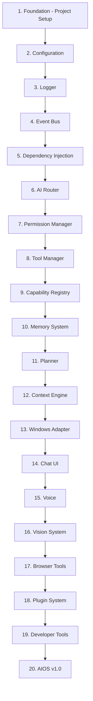

# Architecture Freeze v1.0

**Document ID:** ARCHITECTURE_FREEZE_v1.0  
**Status:** Frozen  
**Version:** 1.0.0  
**Last Updated:** 2026-07-18

---

## 1. Purpose

This document confirms that the AIOS architecture is frozen and ready for implementation. All module names, folder structures, communication rules, public interfaces, and coding standards are finalized.

## 2. Freeze Confirmation

The following items are **frozen** and must not be changed without updating documentation first:

### 2.1 Module Names (Finalized)

| Module | Status | File |
|--------|--------|------|
| Event Bus | Frozen | `src/backend/aios/core/event_bus.py` |
| AI Router | Frozen | `src/backend/aios/core/ai_router.py` |
| Planner | Frozen | `src/backend/aios/core/planner.py` |
| Tool Manager | Frozen | `src/backend/aios/core/tool_manager.py` |
| Permission Manager | Frozen | `src/backend/aios/core/permission_manager.py` |
| Capability Registry | Frozen | `src/backend/aios/core/capability_registry.py` |
| Memory System | Frozen | `src/backend/aios/core/memory_system.py` |
| Context Engine | Frozen | `src/backend/aios/core/context_engine.py` |
| Conversation System | Frozen | `src/backend/aios/core/conversation.py` |
| State Machine | Frozen | `src/backend/aios/core/state_machine.py` |
| Windows Adapter | Frozen | `src/backend/aios/adapters/windows_adapter.py` |
| Vision System | Frozen | `src/backend/aios/vision/screenshot.py` |
| Plugin Manager | Frozen | `src/backend/aios/plugins/plugin_manager.py` |

### 2.2 Folder Structure (Finalized)

```
aios/
├── src/
│   ├── frontend/          # React/TypeScript UI
│   ├── backend/           # Python backend
│   │   ├── aios/
│   │   │   ├── core/     # Core modules (Event Bus, AI Router, Planner, Tool Manager, Permission Manager, Capability Registry, Memory System, Context Engine, Conversation, State Machine)
│   │   │   ├── adapters/ # OS abstraction (Windows Adapter)
│   │   │   ├── tools/    # Built-in tools (file operations, system info, process manager, clipboard, browser)
│   │   │   ├── vision/   # Vision system (screenshot, OCR, UI understanding)
│   │   │   ├── plugins/  # Plugin system (plugin manager, sandbox)
│   │   │   ├── models/   # Data models
│   │   │   ├── db/       # Database (SQLite, migrations)
│   │   │   ├── api/      # API routes (chat, tools, capabilities, settings, plugins)
│   │   │   └── utils/    # Utilities (logger, config, encryption)
│   │   └── ...
│   └── shared/            # Shared types
├── plugins/               # Plugin directory
├── docs/                  # Documentation
├── tests/                 # Test suites
├── scripts/               # Build and dev scripts
├── config/                # Configuration
└── resources/             # Static resources
```

### 2.3 Communication Rules (Finalized)

1. **All inter-module communication goes through the Event Bus**
2. **Modules never import each other directly**
3. **The Planner never knows specific tool IDs**
4. **The Planner queries the Capability Registry for capabilities**
5. **The Windows Adapter is the only module that calls Windows APIs**
6. **Tool execution always flows through the Tool Manager**
7. **Every action goes through the Permission Manager**
8. **Plugins run in sandboxed subprocesses**
9. **The UI never contains business logic**
10. **Eve never executes tools directly**

### 2.4 Data Ownership (Finalized)

| Data | Owner | Storage |
|------|-------|---------|
| Conversations | Memory System | SQLite |
| Messages | Memory System | SQLite |
| Tool calls | Tool Manager | SQLite |
| Permission requests | Permission Manager | SQLite |
| Memories | Memory System | SQLite + Vector |
| Context | Context Engine | SQLite |
| Events | Event Bus | SQLite |
| Settings | Configuration | YAML + SQLite |
| Plugin configs | Plugin Manager | SQLite |
| Capabilities | Capability Registry | In-memory + SQLite |
| Active state | State Machine | In-memory |

### 2.5 Public Interfaces (Finalized)

| Module | Public Methods | Documented In |
|--------|---------------|---------------|
| Event Bus | publish, subscribe, unsubscribe, get_history | 07-Event-Bus.md |
| AI Router | route, route_stream, register_provider, health_check, get_capabilities | 08-AI-Router.md |
| Planner | create_plan, execute_plan, validate_plan, recover_plan | 09-Planner.md |
| Tool Manager | register_tool, execute, get_tool, list_tools, search_tools | 10-Tool-Manager.md |
| Permission Manager | check_permission, request_permission, grant_permission, deny_permission, get_pending_requests | 11-Permission-System.md |
| Capability Registry | register_capability, find_capability, find_best_match, list_capabilities, search_capabilities | 29-Capability-Registry.md |
| Memory System | store, search, recall, forget, get_conversation | 12-Memory-System.md |
| Context Engine | get_current_context, get_active_app, get_active_file, detect_project, get_recent_activity | 22-Context-Engine.md |
| Conversation System | send_message, stream_message, get_history, create_conversation, delete_conversation, switch_mode | 23-Conversation-System.md |
| Windows Adapter | search_files, read_file, write_file, delete_file, create_directory, list_processes, start_process, kill_process, get_system_info, get_screenshot, click, type_text | 20-Windows-Adapter.md |
| Vision System | capture_screen, extract_text, find_element, get_active_window_info, detect_ui_elements | 21-Vision-System.md |
| Plugin SDK | register_tool, subscribe, publish, store_memory, search_memory, show_notification, show_dialog, get_config, set_config | 13-Plugin-SDK.md |
| State Machine | transition, get_current_state, get_history, reset | 26-State-Machine.md |

### 2.6 Coding Standards (Finalized)

Refer to [06-Coding-Standards](06-Coding-Standards.md) for:
- Naming conventions (Python + TypeScript)
- Error handling patterns
- Logging standards
- Dependency injection
- Configuration management
- Testing standards
- Documentation standards

## 3. Documentation as Single Source of Truth

The `/docs` directory is the **single source of truth** for AIOS.

| Document | Contents |
|----------|----------|
| 00-Vision.md | Mission, philosophy, long-term goals |
| 01-PRD.md | Requirements, user stories |
| 02-System-Architecture.md | High-level architecture, diagrams |
| 03-TDR.md | Technology decisions |
| 04-Development-Roadmap.md | Phased development plan |
| 05-Folder-Structure.md | Directory layout |
| 06-Coding-Standards.md | Code style and conventions |
| 07-Event-Bus.md | Inter-module communication |
| 08-AI-Router.md | AI provider abstraction |
| 09-Planner.md | Task decomposition |
| 10-Tool-Manager.md | Tool registration and execution |
| 11-Permission-System.md | Permission levels and flows |
| 12-Memory-System.md | Memory management |
| 13-Plugin-SDK.md | Third-party plugins |
| 14-Eve-Personality.md | Assistant voice and tone |
| 15-UI-UX-Guidelines.md | Design system |
| 16-Database-Schema.md | Complete database design |
| 17-API-Specification.md | REST API documentation |
| 18-Testing-Strategy.md | Testing approach |
| 19-Security-Architecture.md | Security design |
| 20-Windows-Adapter.md | OS abstraction |
| 21-Vision-System.md | Screen capture and OCR |
| 22-Context-Engine.md | Contextual awareness |
| 23-Conversation-System.md | Chat and voice |
| 24-Developer-Guide.md | Development setup |
| 25-CONTRIBUTING.md | Contribution guidelines |
| 26-State-Machine.md | System lifecycle states |
| 27-Sequence-Diagrams.md | End-to-end workflows |
| 28-Error-Recovery.md | Error recovery strategies |
| 29-Capability-Registry.md | Capability-based discovery |

## 4. Architecture Change Policy

Any future architecture changes must follow this process:

1. **Propose** — Create a GitHub Issue describing the change
2. **Document** — Update the relevant documentation files first
3. **Review** — Architecture review by lead maintainer
4. **Approve** — Approval by architecture team
5. **Implement** — Code changes after documentation is updated
6. **Freeze** — Update this document with new freeze version

## 5. Implementation Dependency Order



## 6. Sign Off

The AIOS architecture is **frozen** at version 1.0.0.

All 29 documentation files and the architecture freeze are complete.

Implementation may begin in the order specified in Section 5.

---

**Architecture Freeze Date:** 2026-07-18  
**Next Freeze Version:** 2.0.0 (if breaking changes are required)
